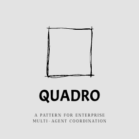
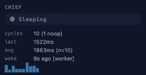
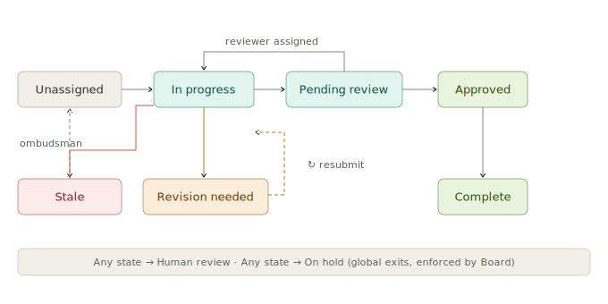
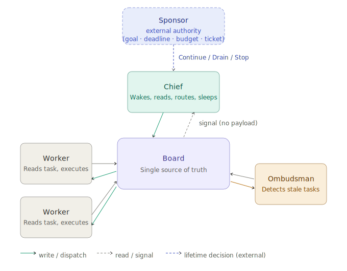

<p align="center">
  
</p>

<p align="center">
  A coordination layer for enterprise multi-agent LLM systems
</p>

<p align="center">
  <a href="https://github.com/ESgarbi/quadro/actions/workflows/ci.yml"></a>
  <a href="https://github.com/ESgarbi/quadro/actions/workflows/lint.yml"></a>
  <a href="https://github.com/ESgarbi/quadro/actions/workflows/security.yml"></a>
  <a href="LICENSE"></a>
  <a href="https://www.python.org/"></a>
</p>


---

## Contents

- [The Coordination Gap](#the-coordination-gap)
- [Quickstart](#quickstart)
- [The Board](#the-board)
- [The Chief](#the-chief)
- [Governance](#governance)
- [Lifetime — the Sponsor](#lifetime--the-sponsor)
- [How this relates to existing work](#how-this-relates-to-existing-work)
- [Reference implementation](#reference-implementation)
- [Pattern reference](#pattern-reference)
- [Contributing](#contributing)

---


## The Coordination Gap

Enterprise processes require structure, accountability, and state clarity. When an order needs to be fulfilled, an invoice approved, a support ticket resolved, or a document cleared through legal review, the process has structure that exists for reasons: compliance, accountability, auditability, and the ability to answer: 

> *"What state is this in right now, and who is responsible for it?"*

When those questions cannot be answered, something has gone wrong—not with the agents, but with the **coordination layer** they are operating in.

### The Multi-Agent Problem
The coordination problem surfaces as three questions every agent in a multi-agent system implicitly needs answered:

* **What should I work on?** In a single-agent system this is trivial—the user's prompt is the task. In a multi-agent system, something needs to decide which agent works on which task and in what order. Left implicit, agents duplicate work, block each other, or idle while work sits waiting.
* **When should I start?** A writing agent cannot start until a research agent has finished. A review agent should not be dispatched before a draft exists. These sequencing constraints are coordination logic. When they live inside individual agent prompts, they are fragile, untestable, and invisible.
* **When am I done?** An agent that transitions a task to completion needs to know what "complete" means for that task type, and so does everything downstream. Without a shared, enforced definition of terminal state, agents finish—and nothing happens, because nothing reliably knows they finished.

### The Quadro Solution
Quadro's answer is a durable shared surface
— the **Board** — that holds the state of all work, a coordinator — the **Chief** —
that reacts to changes in that state and dispatches the next action, and a governed
state machine that enforces what transitions are legal. The agent's questions become
structural properties of the system rather than logic buried inside individual prompts.

We achieve this through three core components:
1. **The Board:** A durable shared surface that holds the state of all work.
2. **The Chief:** A coordinator that reacts to changes in that state and dispatches the next action.
3. **Governed State Machine:** A strict ruleset that enforces which transitions are legal.

These three components are the Reactive Governed Blackboard. Lifetime —
*should the runtime still be working at all?* — is a separate concern,
governed by an **external signal** called the **Sponsor**. The Sponsor sits
outside the reactive pattern; it answers to whatever authority makes sense
for the deployment (a goal predicate, a deadline, a token budget, an open
CRM ticket, an approving HTTP endpoint). See
[Lifetime — the Sponsor](#lifetime--the-sponsor) below.

Quadro is a reference implementation of the Reactive Governed Blackboard pattern -- the first piece of what is intended to grow into a broader pattern language for governed multi-agent coordination.

### Activity is not progress

Most multi-agent frameworks today treat agent activity as the default state. Agents
loop, explore, call tools, and reason about what to do next — and the system is
considered "working" as long as agents are active. The implicit assumption is that
activity equals progress.

The cost of this assumption is that activity and progress become indistinguishable.
An agent burning tokens in a reasoning loop looks the same as an agent making a
decision that matters. There is no structural signal for "everything that can be done
right now is being done."

Quadro produces the inverse. The reactive board pattern constrains boundaries: the
Chief cannot speculate, cannot explore, cannot act without a task driving it. When
all three components work together, the coordinator spends most of its time dormant.
This dormancy is not idle time — it is a positive signal. A sleeping Chief means
exactly one of two things: either all dispatchable work has been dispatched and
agents are executing, or there is no work to do. Both are correct states. There is
no third state — no speculative activity, no exploratory loops, no token spend
without a governed task behind it.

For enterprise systems, this distinction is operational. You do not want a system
that is perpetually curious. You want one that can demonstrate, at any moment, that
it is either acting on a specific governed task or correctly waiting for one. Every
token spent should correspond to either a governed task execution or a coordinator
decision — and if the Chief wakes and finds nothing to act on, the telemetry records
it as a no-op. That is measurable waste, not invisible overhead.

We call this observable rhythm the *sleep pattern*. Early observations from running
Quadro pipelines suggest that systems whose coordinators maintain long, uninterrupted
sleep intervals between decision cycles exhibit fewer redundant dispatches and
smoother throughput. Formal analysis is planned (see [TODO item 13](TODO.md)).

---

## Quickstart

```bash
git clone https://github.com/esgarbi/quadro.git
cd quadro
pip install -e ".[dev]"
```

Run the deterministic examples (no API key needed):

```bash
python examples/newsroom_cooperation.py
python examples/ordering_system.py
pytest  # 250+ tests, no external dependencies
```

Run the LLM-backed examples (requires `OPENAI_API_KEY`):

```bash
python examples/microsoft_agent_framework/newsroom/main.py
python examples/microsoft_agent_framework/ordering_system/main.py
```

Watch the live Board UI while an example runs:

```bash
# board.db is created automatically when an example runs
python -m quadro.ui newsroom.db --open
```

```python
from types import SimpleNamespace

from quadro import ChiefAgent, QuadroRuntime, WorkerAgent
from quadro.board.backends.sqlite import SqliteBoardBackend
from quadro.sponsor import GoalSponsor

runtime = QuadroRuntime(SqliteBoardBackend()).with_profiles(
    profile_resolver={"mywork": "fast"},
)
bc = runtime.client

def do_work(context, board_fn):
    task = context["payload"]["task"]
    board_fn("board.update_task", {
        "task_id": task["task_id"],
        "to_status": "COMPLETE",
    })
    return "done"

worker = (
    WorkerAgent.builder("worker_1", bc)
    .capability("mywork")
    .at("a2a://workers/1")
    .execute(do_work)
    .wakes("a2a://chief")
    .build()
)
worker.register()

chief = ChiefAgent.builder(bc).at("a2a://chief").build()
bc.post_task("mywork", "do something useful")

# Quadro's lifetime is governed by a Sponsor. GoalSponsor is the drop-in
# "run until this predicate is true" shape; see the Lifetime section below
# for richer authorities (deadline, budget, external systems).
runtime.sponsor(
    GoalSponsor(lambda s: all(t["status"] == "COMPLETE" for t in s["tasks"]))
).run(SimpleNamespace(chief=chief))
```

The `fast` profile allows `IN_PROGRESS → COMPLETE` directly. The default
`review_required` profile enforces a review step — see [Governance](#governance)
below. The Chief's default routing matches `task_type` to `capability`
automatically — no custom policy needed for simple pipelines.

---

## The Board

An LLM agent is a function. It executes, produces output, and ceases to exist. When
multiple agents collaborate on a shared body of work, the question of where state
lives, who owns it, and how it transitions through stages is left entirely to the
developer. Most teams resolve this by scattering state across agent contexts, message
threads, and reachable databases, then patching the edges when something goes wrong.

The fix is structural. **The Board** is a single, durable surface that holds the
current state of every task, every assignment, and every result. An agent wakes, reads
what it needs from the Board, does its work, and writes back. Then it exits. The Board
is the only memory between invocations.

This imposes a discipline called **Hydration**: the agent's full working context is
assembled from the Board's current state at invocation time. Same Board state, same
context — every time. No implicit queries at runtime. No context window that grows
with the age of the process.

## The Chief

**The Chief** is the coordinator. It never executes tasks. It reads the Board, decides
what should happen next, writes those decisions back to the Board, dispatches workers,
and sleeps.

No agent sends the Chief a message. Agents do one thing — they write to the Board.
When the Board changes, a signal carrying no data wakes the Chief. The signal carries
no payload — no task ID, no status, no summary of what happened. It means only: *the
board changed; look at it.* The Chief opens the Board, sees the full picture of
everything in flight, acts on all of it in a single pass, and goes back to sleep.
No polling. No partial state. No wasted cycles. If there's nothing to do, it says so
and sleeps again.

The insight that shaped Quadro is simple: a coordinator that never executes tasks has no reason to be awake between decisions. It should sleep. The coordinator's natural state is dormant, not busy.



<BR>
<BR> 
  


> This is different from polling, which wakes on a timer whether or not anything changed.
> It is different from event callbacks, where the coordinator handles one event at a
> time — always reasoning from a fragment, never the whole. The Chief wakes only when
> the board has actually changed, reads the full state, and acts on all of it.


## Governance

Durable state and a reactive coordinator are not enough if the state machine is
implicit. Most systems have one: a `status` column, an enum, some if-statements. It
works until a bug moves a task directly from `IDEATING` to `PUBLISHED`, or two agents
independently transition the same task in different directions.

A **Lifecycle Profile** is a formal contract for a class of work: a set of valid state
transitions declared at startup. The Board rejects illegal transitions mechanically,
before any application code runs — a `TransitionError`, not a silent overwrite. Every
transition emits an immutable event into an append-only log, so the audit trail writes
itself without any additional instrumentation.

When an agent crashes mid-task, the **Ombudsman** detects the silence: heartbeats stop,
the task is marked stale, and the Chief is woken. The Chief opens the board, sees a
stale task among whatever else is happening, and reassigns it as part of its normal
pass. Recovery is not a special case.

The `review_required` lifecycle — the states a task moves through, the revision
back-edge, and the Ombudsman recovery path:

<p align="center">
  
</p>

## Board + Chief + Governed lifecycle

This combination — durable Board, reactive Chief, governed lifecycle, deterministic
Hydration — is the **Reactive Governed Blackboard**: an adaptation of the classical
Blackboard architectural pattern for stateless LLM agents. Three properties
distinguish it:

- **Governed.** Lifecycle transitions are enforced mechanically. Every transition is
  auditable. Illegal moves are rejected, not logged.
- **Hydrated.** Context is injected at invocation from the current Board state.
  Not accumulated, not grown over time, not queried on demand.
- **Reactive.** The coordinator wakes when the Board changes, surveys everything,
  and acts. No polling. No event callbacks carrying partial state.

The result: adding more agents, more task types, or more pipeline stages does not
degrade the coordinator's decision quality. The Chief always sees a clean board.
Workers always see a fully hydrated, deterministic task.

How the components relate at runtime — the Board at centre, the Chief reacting to it,
Workers reading and writing tasks, the Ombudsman monitoring heartbeats, and the
Sponsor governing runtime lifetime from outside the pattern (dashed, so the visual
separation between coordination and lifetime is clear):

<p align="center">
  
</p>

---

## Lifetime — the Sponsor

The Reactive Governed Blackboard pattern defines how work is coordinated, not
how long the runtime should keep running. That question — *should we still be
working on this?* — is distinct from *has the work completed?* and is usually
answered by something outside the runtime itself: a mission goal, a scheduled
window, a CRM ticket being open, a budget still positive.

Quadro exposes that seam as a **Sponsor**. A Sponsor is consulted by the
`RunLoop` at startup and on lease expiry, and returns one of `Continue`,
`Drain`, or `Stop`. The built-in `GoalSponsor(predicate)` covers the common
case ("run until my goal is met"); `DeadlineSponsor`, `TickBudgetSponsor`,
`LlmTokenBudgetSponsor`, and `HttpSponsor` let you add wall-clock, cost, or
external-authority caps by composition with `AllOf` / `AnyOf` / `Priority`.

This is a lifetime model, not a pattern primitive. The Board, Chief, and
governed lifecycle are unchanged whether your Sponsor is a one-line predicate
or an HTTP call to a ticketing system. See
[`docs/design/sponsor.md`](docs/design/sponsor.md) for the full design and
[`examples/crm_sponsor/`](examples/crm_sponsor/) for a worked CRM-gated run.

---

## How this relates to existing work

The ingredients are not novel. Blackboard architecture dates to Newell and Simon in
the 1960s. Event sourcing is well-established in distributed systems. State machine
governance appears in every workflow engine. LangGraph, Temporal, and Durable Functions
each touch parts of this space.

In 2025, the blackboard model resurfaced independently across the industry. Google
researchers demonstrated a blackboard MAS outperforming RAG and master-slave baselines
by 13–57% on data science benchmarks (arXiv:2510.01285). A separate paper proposed
the first formal blackboard framework for general LLM-based multi-agent systems
(arXiv:2507.01701). Confluent named blackboard as one of four key patterns for
event-driven multi-agent systems. AWS published the Arbiter Pattern, which uses a
shared semantic blackboard as its coordination substrate — though the Arbiter extends
well beyond that, adding LLM-driven task decomposition, dynamic agent generation via a
Fabricator, and contextual memory across cycles. The Chief does none of those things;
its correctness comes from governance structure rather than reasoning. They are
different answers to different questions about multi-agent coordination at this time.

Quadro is a ground-up implementation of the Blackboard architectural pattern for stateless LLM agents extended with three constraints: governed lifecycle transitions (the Board rejects illegal moves mechanically), deterministic hydration (same state → same context, verifiable by hash), and reactive coordination (the Chief surveys the full board on wake, never a partial event stream). Together, these constraints form what we call the Reactive Governed Blackboard — not a new pattern, but a specific discipline applied to a classical one.

| If you have...            | Quadro adds...                                                       |
|---------------------------|----------------------------------------------------------------------|
| Agent Framework / AutoGen | The Board as a governed coordination surface above the session layer |
| LangGraph                 | An explicit task lifecycle with validated transitions and audit trail |
| Temporal                  | The agent-specific hydration contract and chief coordination pattern |
| A raw message bus         | The named vocabulary and lifecycle semantics for agent work          |

---

## Reference implementation

Python, using Microsoft Agent Framework for LLM execution and A2A for
inter-component communication. Reference implementation of the pattern; production
hardening in progress.

**Core (`src/quadro/`)**

- `QuadroBoard` — board, SQLite backend, validated lifecycle, immutable event log
- `BoardClient` — typed wrapper around the board's A2A interface (`board.client()`)
- `ChiefAgent` — reactive coordinator, pending-wake serialisation, telemetry
- `WorkerAgent` — stateless worker, automatic `HUMAN_REVIEW` transition on crash, heartbeat
- `WorkerPool` — fluent builder for N-worker-per-capability pools with Ombudsman
- `RunLoop` — sponsor-governed poll loop, per-cycle callback, Ombudsman integration
- `Ombudsman` — stale heartbeat detection for standard and custom profiles
- `LifecycleBuilder` — fluent builder for custom task lifecycle profiles
- `lifecycle()` — function-form lifecycle declaration from a list of transitions
- `serve_board()` — zero-dependency live Kanban server, stdlib only

**Built-in lifecycle profiles**

Two profiles are available out of the box:

- `review_required` — `UNASSIGNED → IN_PROGRESS → PENDING_REVIEW → APPROVED → COMPLETE`
- `fast` — `UNASSIGNED → IN_PROGRESS → COMPLETE`

Both profiles automatically include `HUMAN_REVIEW` and `ON_HOLD` as global exits
from any state, and `STALE → UNASSIGNED` for Ombudsman recovery.

**Custom lifecycle profiles**

For multi-stage pipelines, use `LifecycleBuilder` to declare the exact transitions
your domain requires. The Board enforces them — nothing else needs to know the rules.

```python
from quadro import LifecycleBuilder

ARTICLE_LIFECYCLE = (
    LifecycleBuilder()
    .step("UNASSIGNED",     "ideating")
    .step("ideating",       "idea_ready")
    .step("idea_ready",     "researching")
    .step("researching",    "research_ready")
    .step("research_ready", "writing")
    .step("writing",        "draft_ready")
    .step("draft_ready",    "reviewing")
    .step("reviewing",      "published")
    .revision("reviewing",  "idea_ready")   # reviewer can send back for rework
    .build()
)
```

Three builder methods cover all transition types:

- `.step(from, to)` — main pipeline progression. Both states appear in Board UI
  column order in declaration sequence.
- `.revision(from, to)` — back-edge for revision loops. Transition is enforced;
  the destination state is already declared so column order is unchanged.
- `.loop(from, to)` — self-healing cycle back to an earlier stage (e.g. a
  procurement step that loops back to stock-checking).
- `.branch(from, to)` — alternative exit from a state (e.g. a validation step that
  can also produce `validation_failed`).

Register the lifecycle with the board at construction time:

```python
board = QuadroBoard(
    SqliteBoardBackend(),
    profile_resolver={"article": "article"},   # task_type → profile name
    custom_profiles={"article": ARTICLE_LIFECYCLE},
    network=network,
    url="a2a://board",
)
```

For simpler cases, `lifecycle()` accepts a plain list of `(from, to)` tuples and
derives column order from declaration sequence:

```python
from quadro import lifecycle

ORDER_LIFECYCLE = lifecycle([
    ("UNASSIGNED", "validating"),
    ("validating",  "validated"),
    ("validated",   "delivering"),
    ("delivering",  "delivered"),
])
```

**TOML lifecycle files**

Lifecycle profiles can also be declared in `.lifecycle.toml` files — useful for
versioning lifecycle definitions separately from code, or sharing them across
services. Uses stdlib `tomllib` (Python 3.11+), no extra dependencies.

```toml
name = "article"

steps = [
    ["UNASSIGNED", "ideating"],
    ["ideating", "idea_ready"],
    ["idea_ready", "researching"],
    ["researching", "research_ready"],
    ["research_ready", "writing"],
    ["writing", "draft_ready"],
    ["draft_ready", "reviewing"],
    ["reviewing", "published"],
]

revisions = [
    ["reviewing", "idea_ready"],
]
```

Load and register it:

```python
from quadro import load_lifecycle

name, lifecycle = load_lifecycle("article.lifecycle.toml")

board = QuadroBoard(
    SqliteBoardBackend(),
    profile_resolver={"article": name},
    custom_profiles={name: lifecycle},
    network=network,
)
```

All examples support a `--lifecycle` flag to load from a TOML file instead of
the built-in Python declaration.

**WorkerPool**

For pipelines with multiple capabilities, `WorkerPool` handles agent creation,
registration, and Ombudsman configuration in one fluent call:

```python
from quadro import WorkerPool

pool = (
    WorkerPool(bc)
    .workers(3)                  # 3 agents per capability
    .wakes("a2a://chief")
    .add("ideation", run_ideation, active_status="ideating",    max_working_time=5.0)
    .add("research", run_research, active_status="researching", max_working_time=5.0)
    .add("writing",  run_writing,  active_status="writing",     max_working_time=5.0)
    .add("review",   run_review,   active_status="reviewing",   max_working_time=5.0)
    .build()
)

ombudsman = pool.ombudsman()   # pre-configured with per-capability timeouts
```

`max_working_time` is in minutes. Workers that exceed it without posting a heartbeat
are marked stale and reassigned by the Chief automatically.

**Examples**

LLM-backed (requires `OPENAI_API_KEY`):

### `examples/microsoft_agent_framework/ordering_system/` — LLM order fulfilment with inventory management

*Ordering system* — continuous dispatch under pressure
The ordering system is a high-throughput pipeline: orders arrive, get validated against customer records, checked against warehouse inventory, and dispatched for delivery. The Chief barely sleeps — in the demo you'll see it almost permanently in "Acting" state, continuously assigning workers, routing orders through stock checks, and pushing fulfilled orders to shipping. This is Quadro under sustained load: the coordinator working as fast as the pipeline feeds it, with every transition governed and every assignment auditable even at speed.


### `examples/microsoft_agent_framework/newsroom/` — 9-stage newsroom pipeline with PubMed research and revision loop

*Newsroom* — long-running generative work with a sleeping coordinator
The newsroom is a 9-stage pipeline where each task is a full article: topic ideation, PubMed research, draft writing, editorial review, and publication. Each stage involves genuine LLM generation — a research agent queries PubMed and synthesizes findings, a writing agent produces a full draft, a reviewer sends it back for revision or approves it. These stages take time. And in that time, the Chief sleeps. You can watch it happen in the Board UI: the coordinator wakes, dispatches a writer, and returns to sleep. Minutes pass. The writer finishes, writes to the board, the signal fires, the Chief wakes, reads the full board state, dispatches the next stage, and sleeps again. The cycle is visible in the telemetry panel: long dormant intervals punctuated by brief, decisive action. The published articles — complete with PubMed citations — are in `examples/microsoft_agent_framework/newsroom/output/`.


Deterministic (no API key required):

- `examples/newsroom_cooperation.py` — research / write / review pipeline, pure Python workers
- `examples/ordering_system.py` — order lifecycle with board-held inventory

**Known limitations**

- `LocalA2ANetwork` only — no HTTP transport for multi-process deployments
  (`A2ATransport` Protocol is in place; `HttpA2ANetwork` is the next step)
- SQLite backend only — PostgreSQL, MySQL, Redis planned

See [`TODO.md`](TODO.md) for the full open item list and [`IMPLEMENTATION_ROADMAP.md`](IMPLEMENTATION_ROADMAP.md) for milestone status.

---

## Pattern reference

| Concept | Definition |
|---|---|
| **The Board** | Single durable surface. Every agent reads from it before acting, writes to it when done. |
| **Hydration** | Reconstructing an agent's full context from the Board at invocation time. Deterministic. |
| **Stateless invocation** | One invocation: read Board, act, write Board, exit. Next invocation starts fresh. |
| **The Chief** | Coordinator that reacts to Board changes, dispatches workers, never executes tasks. |
| **Lifecycle profile** | Declared valid state transitions for a task type. Board enforces; illegal moves rejected. |
| **LifecycleBuilder** | Fluent API for declaring custom lifecycle profiles with steps, revisions, and branches. |
| **Frozen taxonomy** | Fixed set of event types emitted by the Board. Every transition is auditable. |
| **The Ombudsman** | Detects stale heartbeats, marks tasks for reassignment. Recovery by design, not exception. |
| **Reactive Wakeup** | Chief wakes on a signal (no payload), reads full board, acts on all visible concerns, sleeps. |

---

## Contributing

See [`CONTRIBUTING.md`](CONTRIBUTING.md) for setup, test conventions, and architecture invariants.

---

> Personal project · v0.1 reference implementation · Contributions welcome · Maintenance is best-effort

## License

MIT. See [LICENSE](LICENSE).
