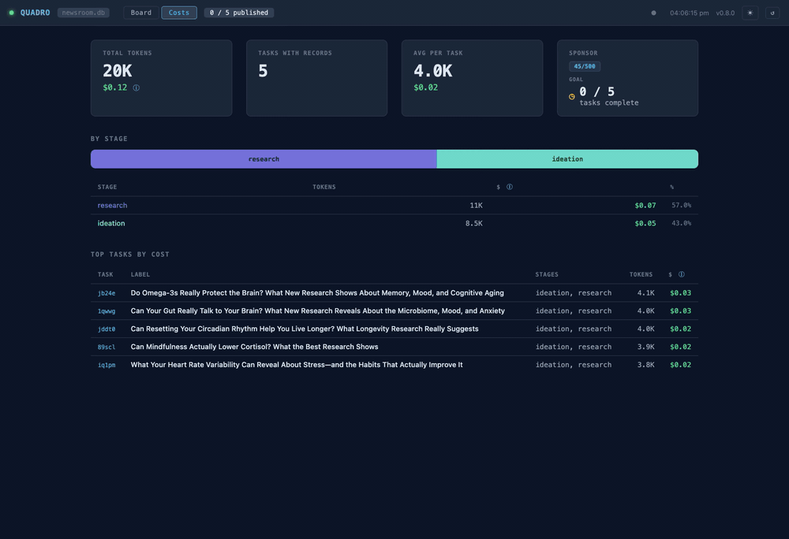
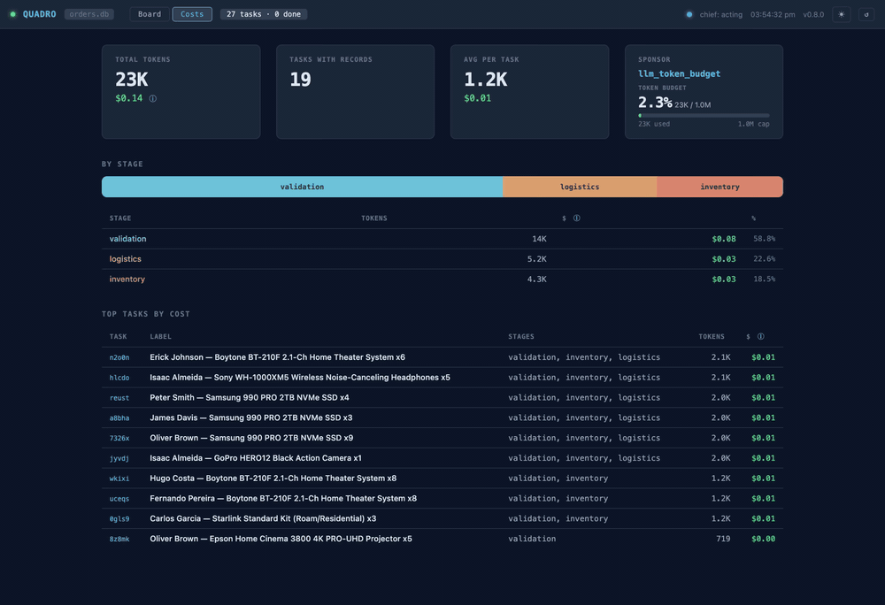

<p align="center">
  
</p>

<p align="center">
  A governed coordination substrate for multi-agent LLM systems
</p>

<p align="center">
  <a href="https://github.com/ESgarbi/quadro/actions/workflows/ci.yml"></a>
  <a href="https://github.com/ESgarbi/quadro/actions/workflows/lint.yml"></a>
  <a href="https://github.com/ESgarbi/quadro/actions/workflows/security.yml"></a>
  <a href="LICENSE"></a>
  <a href="https://www.python.org/"></a>
</p>


---

## Contents

- [The Coordination Gap](#the-coordination-gap)
- [Quickstart](#quickstart)
- [The Board](#the-board)
- [The Chief](#the-chief)
- [Governance](#governance)
- [Sagas — declarative work inside a stage](#sagas--declarative-work-inside-a-stage)
- [Lifetime — the Sponsor](#lifetime--the-sponsor)
- [Cost projection — the Estimator](#cost-projection--the-estimator)
- [How this relates to existing work](#how-this-relates-to-existing-work)
- [Reference implementation](#reference-implementation)
- [Pattern reference](#pattern-reference)
- [Contributing](#contributing)

---


## The Coordination Gap

Enterprise processes require structure, accountability, and state clarity. When an order needs to be fulfilled, an invoice approved, a support ticket resolved, or a document cleared through legal review, the process has structure that exists for reasons: compliance, accountability, auditability, and the ability to answer: 

> *"What state is this in right now, and who is responsible for it?"*

When those questions cannot be answered, something has gone wrong—not with the agents, but with the **coordination layer** they are operating in.

### The Multi-Agent Problem
The coordination problem surfaces as three questions every agent in a multi-agent system implicitly needs answered:

* **What should I work on?** In a single-agent system this is trivial—the user's prompt is the task. In a multi-agent system, something needs to decide which agent works on which task and in what order. Left implicit, agents duplicate work, block each other, or idle while work sits waiting.
* **When should I start?** A writing agent cannot start until a research agent has finished. A review agent should not be dispatched before a draft exists. These sequencing constraints are coordination logic. When they live inside individual agent prompts, they are fragile, untestable, and invisible.
* **When am I done?** An agent that transitions a task to completion needs to know what "complete" means for that task type, and so does everything downstream. Without a shared, enforced definition of terminal state, agents finish—and nothing happens, because nothing reliably knows they finished.

### The Quadro Solution
Quadro's answer is a durable shared surface
— the **Board** — that holds the state of all work, a coordinator — the **Chief** —
that reacts to changes in that state and dispatches the next action, and a governed
state machine that enforces what transitions are legal. The agent's questions become
structural properties of the system rather than logic buried inside individual prompts.

We achieve this through three core components:
1. **The Board:** A durable shared surface that holds the state of all work.
2. **The Chief:** A coordinator that reacts to changes in that state and dispatches the next action.
3. **Governed State Machine:** A strict ruleset that enforces which transitions are legal.

These three components are the Reactive Governed Blackboard. Lifetime —
*should the runtime still be working at all?* — is a separate concern,
governed by an **external signal** called the **Sponsor**. The Sponsor sits
outside the reactive pattern; it answers to whatever authority makes sense
for the deployment (a goal predicate, a deadline, a token budget, an open
CRM ticket, an approving HTTP endpoint). See
[Lifetime — the Sponsor](#lifetime--the-sponsor) below.

Quadro is a reference implementation of the Reactive Governed Blackboard pattern -- the first piece of what is intended to grow into a broader pattern language for governed multi-agent coordination.

### Activity is not progress

Most multi-agent frameworks today treat agent activity as the default state. Agents
loop, explore, call tools, and reason about what to do next — and the system is
considered "working" as long as agents are active. The implicit assumption is that
activity equals progress.

The cost of this assumption is that activity and progress become indistinguishable.
An agent burning tokens in a reasoning loop looks the same as an agent making a
decision that matters. There is no structural signal for "everything that can be done
right now is being done."

Quadro produces the inverse. The reactive board pattern constrains boundaries: the
Chief cannot speculate, cannot explore, cannot act without a task driving it. When
all three components work together, the coordinator spends most of its time dormant.
This dormancy is not idle time — it is a positive signal. A sleeping Chief means
exactly one of two things: either all dispatchable work has been dispatched and
agents are executing, or there is no work to do. Both are correct states. There is
no third state — no speculative activity, no exploratory loops, no token spend
without a governed task behind it.

For enterprise systems, this distinction is operational. You do not want a system
that is perpetually curious. You want one that can demonstrate, at any moment, that
it is either acting on a specific governed task or correctly waiting for one. Every
token spent should correspond to either a governed task execution or a coordinator
decision — and if the Chief wakes and finds nothing to act on, the telemetry records
it as a no-op. That is measurable waste, not invisible overhead.

We call this observable rhythm the *sleep pattern*. Early observations from running
Quadro pipelines suggest that systems whose coordinators maintain long, uninterrupted
sleep intervals between decision cycles exhibit fewer redundant dispatches and
smoother throughput. Formal analysis is planned (see [TODO item 13](TODO.md)).

---

## Quickstart

```bash
git clone https://github.com/esgarbi/quadro.git
cd quadro
pip install -e ".[dev]"
```

Install only what your project uses:

```bash
pip install quadro                 # substrate only
pip install "quadro[maf]"          # Microsoft Agent Framework adapter
pip install "quadro[langchain]"    # LangChain / LangGraph adapter
pip install "quadro[anthropic]"    # Anthropic SDK adapter
```

The substrate has zero LLM-framework dependencies. Adapter packages
(`quadro_maf`, `quadro_langchain`, `quadro_anthropic`) live as siblings to
the core and are imported by user code, never by the substrate itself. Any
LLM SDK can also plug in through a custom reasoner adapter — see
[`examples/minimal/`](examples/minimal/) for a 30-line bare-OpenAI-SDK
reference shape.

Run the deterministic examples (no API key needed):

```bash
python examples/cooperation/main.py
python examples/ordering_minimal/main.py
pytest
```

Run the LLM-backed examples (requires `OPENAI_API_KEY` or `ANTHROPIC_API_KEY`):

```bash
python examples/newsroom/main_pipeline.py
python examples/ordering/main_pipeline.py
python examples/anthropic_minimal/main.py        # Claude reasoner
python examples/estimator/main.py                # cost projection demo
```

Watch the live Board UI while an example runs:

```bash
# board.db is created automatically when an example runs
python -m quadro.ui newsroom.db --open
```

The Board tab shows the live Kanban; the Costs tab attributes token
spend per stage and per task, and renders dollar amounts alongside tokens
when pricing is configured on the runtime — see
[Cost projection — the Estimator](#cost-projection--the-estimator) below.

```python
from types import SimpleNamespace

from quadro import ChiefAgent, QuadroRuntime, WorkerAgent
from quadro.board.backends.sqlite import SqliteBoardBackend
from quadro.sponsor import GoalSponsor

runtime = QuadroRuntime(SqliteBoardBackend()).with_profiles(
    profile_resolver={"mywork": "fast"},
)
bc = runtime.client

def do_work(context, board_fn):
    task = context["payload"]["task"]
    board_fn("board.update_task", {
        "task_id": task["task_id"],
        "to_status": "COMPLETE",
    })
    return "done"

worker = (
    WorkerAgent.builder("worker_1", bc)
    .capability("mywork")
    .at("a2a://workers/1")
    .execute(do_work)
    .wakes("a2a://chief")
    .build()
)
worker.register()

chief = ChiefAgent.builder(bc).at("a2a://chief").build()
bc.post_task("mywork", "do something useful")

# Quadro's lifetime is governed by a Sponsor. GoalSponsor is the drop-in
# "run until this predicate is true" shape; see the Lifetime section below
# for richer authorities (deadline, budget, external systems).
runtime.sponsor(
    GoalSponsor(lambda s: all(t["status"] == "COMPLETE" for t in s["tasks"]))
).run(SimpleNamespace(chief=chief))
```

The `fast` profile allows `IN_PROGRESS → COMPLETE` directly. The default
`review_required` profile enforces a review step — see [Governance](#governance)
below. The Chief's default routing matches `task_type` to `capability`
automatically — no custom policy needed for simple pipelines.

For richer pipelines — multi-step LLM reasoning, validation, audit capture,
retry/deadline modifiers, compensation rollback — see
[Sagas](#sagas--declarative-work-inside-a-stage) below.

---

## The Board

An LLM agent is a function. It executes, produces output, and ceases to exist. When
multiple agents collaborate on a shared body of work, the question of where state
lives, who owns it, and how it transitions through stages is left entirely to the
developer. Most teams resolve this by scattering state across agent contexts, message
threads, and reachable databases, then patching the edges when something goes wrong.

The fix is structural. **The Board** is a single, durable surface that holds the
current state of every task, every assignment, and every result. An agent wakes, reads
what it needs from the Board, does its work, and writes back. Then it exits. The Board
is the only memory between invocations.

This imposes a discipline called **Hydration**: the agent's full working context is
assembled from the Board's current state at invocation time. Same Board state, same
context — every time. No implicit queries at runtime. No context window that grows
with the age of the process.

## The Chief

**The Chief** is the coordinator. It never executes tasks. It reads the Board, decides
what should happen next, writes those decisions back to the Board, dispatches workers,
and sleeps.

No agent sends the Chief a message. Agents do one thing — they write to the Board.
When the Board changes, a signal carrying no data wakes the Chief. The signal carries
no payload — no task ID, no status, no summary of what happened. It means only: *the
board changed; look at it.* The Chief opens the Board, sees the full picture of
everything in flight, acts on all of it in a single pass, and goes back to sleep.
No polling. No partial state. No wasted cycles. If there's nothing to do, it says so
and sleeps again.

The insight that shaped Quadro is simple: a coordinator that never executes tasks has no reason to be awake between decisions. It should sleep. The coordinator's natural state is dormant, not busy.


<BR>
<BR> 
  


> This is different from polling, which wakes on a timer whether or not anything changed.
> It is different from event callbacks, where the coordinator handles one event at a
> time — always reasoning from a fragment, never the whole. The Chief wakes only when
> the board has actually changed, reads the full state, and acts on all of it.


## Governance

Durable state and a reactive coordinator are not enough if the state machine is
implicit. Most systems have one: a `status` column, an enum, some if-statements. It
works until a bug moves a task directly from `IDEATING` to `PUBLISHED`, or two agents
independently transition the same task in different directions.

A **Lifecycle Profile** is a formal contract for a class of work: a set of valid state
transitions declared at startup. The Board rejects illegal transitions mechanically,
before any application code runs — a `TransitionError`, not a silent overwrite. Every
transition emits an immutable event into an append-only log, so the audit trail writes
itself without any additional instrumentation.

When an agent crashes mid-task, the **Ombudsman** detects the silence: heartbeats stop,
the task is marked stale, and the Chief is woken. The Chief opens the board, sees a
stale task among whatever else is happening, and reassigns it as part of its normal
pass. Recovery is not a special case.

The `review_required` lifecycle — the states a task moves through, the revision
back-edge, and the Ombudsman recovery path:

<p align="center">
  
</p>

## Board + Chief + Governed lifecycle

This combination — durable Board, reactive Chief, governed lifecycle, deterministic
Hydration — is the **Reactive Governed Blackboard**: an adaptation of the classical
Blackboard architectural pattern for stateless LLM agents. Three properties
distinguish it:

- **Governed.** Lifecycle transitions are enforced mechanically. Every transition is
  auditable. Illegal moves are rejected, not logged.
- **Hydrated.** Context is injected at invocation from the current Board state.
  Not accumulated, not grown over time, not queried on demand.
- **Reactive.** The coordinator wakes when the Board changes, surveys everything,
  and acts. No polling. No event callbacks carrying partial state.

The result: adding more agents, more task types, or more pipeline stages does not
degrade the coordinator's decision quality. The Chief always sees a clean board.
Workers always see a fully hydrated, deterministic task.

How the components relate at runtime — the Board at centre, the Chief reacting to it,
Workers reading and writing tasks, the Ombudsman monitoring heartbeats, and the
Sponsor governing runtime lifetime from outside the pattern (dashed, so the visual
separation between coordination and lifetime is clear):

<p align="center">
  
</p>

---

## Sagas — declarative work inside a stage

The Reactive Governed Blackboard tells the system *which* stage runs next and
*who* runs it. The work *inside* a stage — the sequence of LLM calls,
deterministic validations, audit captures, retries, and rollback semantics —
is declared with a **saga**.

A saga is a frozen, declarative description of one stage's work. Where a
hand-rolled stage function might mix LLM calls with database writes, retry
loops, and ad-hoc telemetry, a saga separates the *declaration* of what runs
from the *execution bookkeeping* the runtime owns. The runtime persists each
step's output to the Board, resumes from the saved program counter on worker
restart, emits structured telemetry per step, and walks compensations in
reverse order if a later step fails. A worker that crashes mid-saga resumes
exactly where it left off when it comes back; the saga state is just another
Board record.

Every shipping example pipeline is saga-driven. The newsroom uses sagas for
all four stages — ideation, research, writing, review. The ordering example
uses sagas with `.compensate(...)` directives for the rollback path.

### When to use a saga

A Quadro stage supports four authoring shapes. Pick the one that fits the
work:

- **`stage(execute_fn=...)`** for stages that are one Python call.
- **`stage(workflow=...)`** to drive an existing MAF workflow.
- **`stage(supervisor=...)` / `stage(graph=...)`** to drive an existing
  LangGraph supervisor or graph.
- **`stage(saga=...)`** when the stage has structure the framework-native
  paths do not capture.

A saga earns its keep when at least two of these are true: the stage has more
than one side effect, you need to resume after a worker crash without
repeating completed work, you need rollback if a later step fails, you need
an audit trail of what happened inside the stage, or you need typed
retry/deadline behavior on individual operations. For a single-call stage,
`execute_fn` is right and a saga is overkill.

### Step kinds

Eight step kinds cover the common shapes of work inside a stage:

- **`deterministic`** — pure Python, sync or async. Reads task input, writes
  outputs to the saga state.
- **`reason`** — one LLM reasoning episode. The runtime hands prompt and
  user message to a registered `Reasoner` and stores the validated output.
- **`gate`** — predicate-driven branching. The runtime records which branch
  was chosen for audit.
- **`guard`** — pre-condition check. Halts the saga with
  `guard_failed:<step>` if the predicate fails.
- **`expect`** — post-condition with the same halt machinery as `guard`,
  but a distinct telemetry event so audit queries can separate
  pre-conditions from post-conditions.
- **`evidence`** — best-effort audit capture. Failures are logged, never
  fail the saga.
- **`stamp`** — ordered, timestamped audit marker. Useful for version
  numbers, release tags, revision counters.
- **`parallel`** — concurrent mini-sagas with three join modes. `all`
  waits for every branch, `any` continues on first success and cancels
  the rest, `n_of_m` waits for a quorum.

Three step modifiers attach decorators to the most recently added step:

- **`.retry(attempts=N, on=(...,), backoff=...)`** — typed retry loop with
  fixed or exponential backoff.
- **`.deadline(within=timedelta(...))`** — per-attempt wall-clock timeout.
- **`.idempotent(by="<task_field>")`** — saga-wide idempotency key for
  resume-after-crash semantics.

### Compensation

Any step can declare a compensation:

```python
saga = (
    Saga("order")
    .deterministic("accept_order", _accept)
    .compensate("accept_order", undo=_release_order_slot)
    .deterministic("reserve_inventory", _reserve)
    .compensate("reserve_inventory", undo=_release_inventory)
    .deterministic("charge_card", _charge)
    .compensate("charge_card", undo=_refund)
    .deterministic("ship", _ship)
    .build()
)
```

If a later step fails, the runtime walks completed steps in reverse insertion
order and invokes each registered compensation. The default failure mode is
`continue` — a failed compensation is logged but the walker proceeds. Setting
`on_failure="halt"` stops the walker on the first compensation failure, which
is the right discipline when later compensations depend on earlier ones
succeeding. Compensation rollback works the same way through `parallel`
steps: completed branches' compensations are walked in reverse, cancelled
branches do not fire compensations because they did not finish their side
effects.

### Reasoners — bring your own LLM stack

The `Reasoner` protocol is the substrate's deep-agent escape hatch. A
reason step looks like a single LLM call from the saga's perspective, but
the reasoner behind it can do anything: a single API call, a multi-turn
ReAct loop, a hierarchical agent, a tool-using supervisor, an entire
LangGraph wrapped behind one async method. The saga sees one input and one
output; the reasoner owns everything in between.

Three adapter packages ship reasoners for common stacks: `quadro_maf` for
Microsoft Agent Framework, `quadro_langchain` for LangChain / LangGraph,
and `quadro_anthropic` for the Anthropic SDK. The bare-OpenAI proof of the
protocol's reach is [`examples/minimal/`](examples/minimal/README.md): a 30-line
reasoner adapter wrapping the OpenAI SDK directly, paired with a tiny saga,
runs end-to-end with no adapter package installed. The same shape works for
Google, LiteLLM, in-house frameworks, deep agents you build yourself, or
any SDK that can fulfill prompt-in / response-out.

For sagas that need polyglot reasoning — one step through MAF, another
through LangChain — register multiple reasoners and add `via="langchain"`
to the relevant `.reason()` calls. The runtime dispatches each step to the
named reasoner. The framework-neutrality claim is structural, not
aspirational: the substrate package (`src/quadro/`) imports zero LLM
frameworks.

### Authoring reference

[`docs/guides/saga-authoring.md`](docs/guides/saga-authoring.md) is the
full authoring guide — it walks through writing a saga from blank file to
tested pipeline stage, with one section per step kind, a compensation
walkthrough, the deep-agent custom reasoner pattern, and testing patterns.
Read the guide when you want to write a saga; read this section when you
want to know what sagas are.

---

## Lifetime — the Sponsor

The Reactive Governed Blackboard pattern defines how work is coordinated, not
how long the runtime should keep running. That question — *should we still be
working on this?* — is distinct from *has the work completed?* and is usually
answered by something outside the runtime itself: a mission goal, a scheduled
window, a CRM ticket being open, a budget still positive.

Quadro exposes that seam as a **Sponsor**. A Sponsor is consulted by the
`RunLoop` at startup and on lease expiry, and returns one of `Continue`,
`Drain`, or `Stop`. The built-in `GoalSponsor(predicate)` covers the common
case ("run until my goal is met"); `DeadlineSponsor`, `TickBudgetSponsor`,
`LlmTokenBudgetSponsor`, and `HttpSponsor` let you add wall-clock, cost, or
external-authority caps by composition with `AllOf` / `AnyOf` / `Priority`.

This is a lifetime model, not a pattern primitive. The Board, Chief, and
governed lifecycle are unchanged whether your Sponsor is a one-line predicate
or an HTTP call to a ticketing system. See
[`docs/design/sponsor.md`](docs/design/sponsor.md) for the full design and
[`examples/crm_sponsor/`](examples/crm_sponsor/README.md) for a worked CRM-gated run.

---

## How this relates to existing work

The ingredients are not novel. Blackboard architecture dates to Newell and Simon in
the 1960s. Event sourcing is well-established in distributed systems. State machine
governance appears in every workflow engine. LangGraph, Temporal, and Durable Functions
each touch parts of this space.

In 2025, the blackboard model resurfaced independently across the industry. Google
researchers demonstrated a blackboard MAS outperforming RAG and master-slave baselines
by 13–57% on data science benchmarks (arXiv:2510.01285). A separate paper proposed
the first formal blackboard framework for general LLM-based multi-agent systems
(arXiv:2507.01701). Confluent named blackboard as one of four key patterns for
event-driven multi-agent systems. AWS published the Arbiter Pattern, which uses a
shared semantic blackboard as its coordination substrate — though the Arbiter extends
well beyond that, adding LLM-driven task decomposition, dynamic agent generation via a
Fabricator, and contextual memory across cycles. The Chief does none of those things;
its correctness comes from governance structure rather than reasoning. They are
different answers to different questions about multi-agent coordination at this time.

Quadro is a ground-up implementation of the Blackboard architectural pattern for stateless LLM agents extended with three constraints: governed lifecycle transitions (the Board rejects illegal moves mechanically), deterministic hydration (same state → same context, verifiable by hash), and reactive coordination (the Chief surveys the full board on wake, never a partial event stream). Together, these constraints form what we call the Reactive Governed Blackboard — not a new pattern, but a specific discipline applied to a classical one.

The substrate is framework-neutral. Adapters for Microsoft Agent Framework,
LangChain, and the Anthropic SDK ship as sibling packages (`quadro_maf`,
`quadro_langchain`, `quadro_anthropic`); custom adapters for any other LLM
SDK plug in through the `Reasoner` protocol. Quadro runs alongside the
LLM stack you already have rather than wrapping it.

| If you have...            | Quadro adds...                                                                                  |
|---------------------------|-------------------------------------------------------------------------------------------------|
| Agent Framework / AutoGen | A governed Board, lifecycle enforcement, a saga DSL for stage internals, and pre-run cost projection — without wrapping the framework |
| LangGraph                 | An explicit task lifecycle with validated transitions, audit trail, saga compensation, and an Estimator for pre-run cost projection; runs alongside LangGraph rather than replacing it |
| Temporal                  | The agent-specific hydration contract, a saga DSL tuned for LLM workloads (reason steps, polyglot reasoners, compensation rollback), and pre-run token-cost projection |
| A raw message bus         | Named vocabulary, lifecycle semantics, saga authoring surface for agent work, and cost visibility from estimate through attribution |

---

## Reference implementation

Python 3.11+. The substrate package (`quadro`) has zero LLM-framework
dependencies and ships with the Board, governed lifecycle, A2A dispatch,
chief and worker coordination, the Sponsor runtime-lifetime model, the
Estimator cost-projection module, the zero-dependency Board UI, and the
saga DSL. LLM-framework adapters live in sibling packages (`quadro_maf`,
`quadro_langchain`, `quadro_anthropic`) installed as optional extras.
Reference implementation of the pattern; production hardening in progress.

**Substrate (`src/quadro/`)**

- `QuadroBoard` — board, SQLite backend, validated lifecycle, immutable event log
- `BoardClient` — typed wrapper around the board's A2A interface (`board.client()`)
- `ChiefAgent` — reactive coordinator, pending-wake serialisation, telemetry
- `WorkerAgent` — stateless worker, automatic `HUMAN_REVIEW` transition on crash, heartbeat
- `WorkerPool` — fluent builder for N-worker-per-capability pools with Ombudsman
- `Pipeline` — substrate builder. Compose adapters via `.reasoner(...)` and `.with_framework_runtime(...)`
- `Saga` / `SagaBuilder` — declarative DSL for stage internals (eight step kinds, three modifiers, compensation rollback)
- `QuadroSagaRuntime` — saga dispatch, persistence, deterministic chief mode for substrate-only pipelines
- `Reasoner` — framework-neutral protocol for LLM reasoning. Anything with `reasoner_id` and async `reason()` qualifies
- `FrameworkRuntime` — protocol for stage-level adapter integrations (chief tooling, native stage paths)
- `RunLoop` — sponsor-governed poll loop, per-cycle callback, Ombudsman integration
- `Ombudsman` — stale heartbeat detection for standard and custom profiles
- `LifecycleBuilder` — fluent builder for custom task lifecycle profiles
- `lifecycle()` — function-form lifecycle declaration from a list of transitions
- `Estimator` — pre-run cost projection via two-pass dry-run sampling or historical replay
- `Pricing` / `ModelPricing` / `Projection` — pricing model and projection result types
- `serve_board()` — zero-dependency live Kanban server with Costs tab, stdlib only

**Adapter packages**



LLM-framework adapters live as siblings to the core, installed via optional extras:

- `quadro_maf` — Microsoft Agent Framework adapter. Provides `MafReasoner`
  (reason-step adapter) and `MafChiefRuntime` (chief-loop adapter for
  `stage(workflow=...)` paths). Install via `pip install "quadro[maf]"`.
- `quadro_langchain` — LangChain / LangGraph adapter. Provides
  `LangChainReasoner` and `LangChainChiefRuntime` with the same shape.
  Install via `pip install "quadro[langchain]"`.
- `quadro_anthropic` — Anthropic SDK adapter. Provides `AnthropicReasoner`
  for reason-step integration with Claude models. Reasoner-only — Anthropic
  ships an SDK rather than a full agent framework, so there is no
  `AnthropicChiefRuntime`; use `stage(execute_fn=...)` for Claude-driven
  chief logic. Install via `pip install "quadro[anthropic]"`.

Adapter packages import `quadro`; `quadro` does not import them. User code
constructs LLM clients with the underlying SDK directly and registers them
on a `Pipeline`:

```python
from agent_framework.openai import OpenAIChatClient
from quadro import Pipeline
from quadro_maf import MafReasoner, MafChiefRuntime

def client_factory():
    return OpenAIChatClient(model="gpt-4o", api_key="...")

pipeline = (
    Pipeline(board)
    .reasoner(MafReasoner(client_factory=client_factory))
    .with_framework_runtime(MafChiefRuntime(client_factory=client_factory))
    .stage(...)
    .build()
)
```

Custom adapters for any other LLM SDK (Google, LiteLLM, in-house frameworks)
plug in through the same `.reasoner(...)` seam — see
[`examples/minimal/`](examples/minimal/README.md) for a 30-line bare-OpenAI-SDK adapter
that demonstrates the substrate's plug-in story.

**Built-in lifecycle profiles**

Two profiles are available out of the box:

- `review_required` — `UNASSIGNED → IN_PROGRESS → PENDING_REVIEW → APPROVED → COMPLETE`
- `fast` — `UNASSIGNED → IN_PROGRESS → COMPLETE`

Both profiles automatically include `HUMAN_REVIEW` and `ON_HOLD` as global exits
from any state, and `STALE → UNASSIGNED` for Ombudsman recovery.

**Custom lifecycle profiles**

For multi-stage pipelines, use `LifecycleBuilder` to declare the exact transitions
your domain requires. The Board enforces them — nothing else needs to know the rules.

```python
from quadro import LifecycleBuilder

ARTICLE_LIFECYCLE = (
    LifecycleBuilder()
    .phase("UNASSIGNED",     "ideating")
    .phase("ideating",       "idea_ready")
    .phase("idea_ready",     "researching")
    .phase("researching",    "research_ready")
    .phase("research_ready", "writing")
    .phase("writing",        "draft_ready")
    .phase("draft_ready",    "reviewing")
    .phase("reviewing",      "published")
    .revision("reviewing",  "idea_ready")   # reviewer can send back for rework
    .build()
)
```

Three builder methods cover all transition types:

- `.phase(from, to)` — main pipeline progression. Both states appear in Board UI
  column order in declaration sequence.
- `.revision(from, to)` — back-edge for revision loops. Transition is enforced;
  the destination state is already declared so column order is unchanged.
- `.loop(from, to)` — self-healing cycle back to an earlier stage (e.g. a
  procurement step that loops back to stock-checking).
- `.branch(from, to)` — alternative exit from a state (e.g. a validation step that
  can also produce `validation_failed`).

Register the lifecycle with the board at construction time:

```python
board = QuadroBoard(
    SqliteBoardBackend(),
    profile_resolver={"article": "article"},   # task_type → profile name
    custom_profiles={"article": ARTICLE_LIFECYCLE},
    network=network,
    url="a2a://board",
)
```

For simpler cases, `lifecycle()` accepts a plain list of `(from, to)` tuples and
derives column order from declaration sequence:

```python
from quadro import lifecycle

ORDER_LIFECYCLE = lifecycle([
    ("UNASSIGNED", "validating"),
    ("validating",  "validated"),
    ("validated",   "delivering"),
    ("delivering",  "delivered"),
])
```

**TOML lifecycle files**

Lifecycle profiles can also be declared in `.lifecycle.toml` files — useful for
versioning lifecycle definitions separately from code, or sharing them across
services. Uses stdlib `tomllib` (Python 3.11+), no extra dependencies.

```toml
name = "article"

phases = [
    ["UNASSIGNED", "ideating"],
    ["ideating", "idea_ready"],
    ["idea_ready", "researching"],
    ["researching", "research_ready"],
    ["research_ready", "writing"],
    ["writing", "draft_ready"],
    ["draft_ready", "reviewing"],
    ["reviewing", "published"],
]

revisions = [
    ["reviewing", "idea_ready"],
]
```

Load and register it:

```python
from quadro import load_lifecycle

name, lifecycle = load_lifecycle("article.lifecycle.toml")

board = QuadroBoard(
    SqliteBoardBackend(),
    profile_resolver={"article": name},
    custom_profiles={name: lifecycle},
    network=network,
)
```

All examples support a `--lifecycle` flag to load from a TOML file instead of
the built-in Python declaration.

**WorkerPool**

For pipelines with multiple capabilities, `WorkerPool` handles agent creation,
registration, and Ombudsman configuration in one fluent call:

```python
from quadro import WorkerPool

pool = (
    WorkerPool(bc)
    .workers(3)                  # 3 agents per capability
    .wakes("a2a://chief")
    .add("ideation", run_ideation, active_status="ideating",    max_working_time=5.0)
    .add("research", run_research, active_status="researching", max_working_time=5.0)
    .add("writing",  run_writing,  active_status="writing",     max_working_time=5.0)
    .add("review",   run_review,   active_status="reviewing",   max_working_time=5.0)
    .build()
)

ombudsman = pool.ombudsman()   # pre-configured with per-capability timeouts
```

`max_working_time` is in minutes. Workers that exceed it without posting a heartbeat
are marked stale and reassigned by the Chief automatically.


## Cost projection — the Estimator

The sleep pattern measures coordination waste — token spend that wasn't
backed by a governed task. The `LlmTokenBudgetSponsor` measures runtime
waste — token spend that exceeds an authorised cap. Both observe what
*has* happened. Neither answers the question that arrives before the run
starts: *if I commit to this queue, what will it actually cost?*

Quadro has a built-in **Estimator**. Given a `Pipeline` with at least one
saga stage and a queue of tasks, `Estimator.from_dry_run(...)` performs a
two-pass run: pass 1 walks the queue without LLM calls to characterise
input shapes, pass 2 samples a small number of representative tasks
through the real reasoner — sorted across the input distribution so the
sample spans the variation the queue contains. The result is a projection
report with mean cost, a 95% confidence interval, per-stage breakdown,
and a coefficient-of-variation warning when inputs are heterogeneous
enough that the estimate is genuinely uncertain.

Pricing is configured on the runtime (not on the Estimator). The same
pricing model attributes actual costs in the Board UI's Costs tab, so
before-the-run estimates and after-the-run attributions are denominated
against the same source.

```python
from quadro import Estimator, Pipeline, QuadroRuntime
from quadro.board.backends.sqlite import SqliteBoardBackend

runtime = (
    QuadroRuntime(SqliteBoardBackend("translation.db"))
    .with_profiles(
        profile_resolver={"translation": "translation"},
        custom_profiles={"translation": TRANSLATION_PROFILE},
    )
    .with_pricing({
        "claude-sonnet-4-6": {"input": 3.0, "output": 15.0, "io_ratio": 0.30},
    })
)

pipeline = (
    Pipeline(runtime.board)
    .reasoner(my_reasoner)
    .stage("translate", saga=translation_saga, active_status="translating")
)

estimator = Estimator.from_dry_run(
    pipeline=pipeline,
    queue=my_queue,
    max_samples=8,
    max_sample_cost_dollars=1.0,
)
print(estimator.format())
```

A real run from `examples/estimator/main.py` (50 translation tasks, 8
samples, Claude Sonnet pricing) prints something like:

```text
=== Estimator dry run ===
Pass 1 (input collection): 50 tasks scanned in 0.4s
Pass 2 (sampling): 6 tasks executed (cost: $0.04)

Sample distribution chosen by input-size span:
  Smallest input:  76 chars
  Largest input:   359 chars
  Middle samples:  4 across the distribution

=== Projection for 50 tasks ===
Total tokens:  ~26K
  Range (95% CI):  19K - 33K
  Per-stage breakdown (mean):
    translating       26K  (100.0%)
  Stdev/task: 211 (CoV 0.40)

Total dollars: ~$0.30
  Range (95% CI):  $0.21 - $0.38

Variance warning: HIGH
   Coefficient of variation: 0.40 (>0.30 threshold)
   Recommendation: run additional samples for a tighter estimate.

Pricing source: configured at runtime startup
Verify current rates at https://anthropic.com/pricing
Sample run cost: $0.04 (already spent; included in your billing)
```

The sample run is bounded by `max_sample_cost_dollars` — the Estimator
will never spend more than the cap before reporting back. Two more
constructor paths cover related needs:

- `Estimator.from_history(client, pricing=...)` — project from existing
  Board token records when you've already executed a slice of work and
  want to project the rest from real per-task costs rather than dry-run
  samples.
- `python -m quadro.estimate <board.db>` — CLI projection from a board's
  persisted history, useful for ad-hoc estimates without writing a script.
  Accepts `--project-tasks N`, `--pricing-file path.json`, and
  `--confidence 0.95` flags.

This is the third tier of the waste-measurement story Quadro is built
around: estimate before you commit, monitor while you spend, attribute
after you finish. The shipped examples cover all three:

- [`examples/estimator/`](examples/estimator/) — the minimal demonstration:
  a 50-task translation queue, projected and optionally executed, with the
  Costs tab showing the result.
- [`examples/synthetic_data/`](examples/synthetic_data/) — the
  industry-shaped demonstration: real Wikipedia passages driving two
  different sagas (SQuAD-style QA and Alpaca-style multi-hop reasoning),
  with the Estimator surfacing per-saga cost asymmetry on heterogeneous
  inputs and projecting against full-scale workloads.


## Realtime usage Board UI

<p align="center">
  
  
</p>

---


### **Examples**

Examples are organized by what they teach, not by which LLM framework they use.
Each folder is self-contained — copy any example as a starting point for a new
pipeline.

LLM-backed (require `OPENAI_API_KEY` or `ANTHROPIC_API_KEY`):

### `examples/ordering/` — LLM order fulfilment with inventory management

*Ordering system* — continuous dispatch under pressure. The ordering system is a high-throughput pipeline: orders arrive, get validated against customer records, checked against warehouse inventory, and dispatched for delivery. The Chief barely sleeps — in the demo you'll see it almost permanently in "Acting" state, continuously assigning workers, routing orders through stock checks, and pushing fulfilled orders to shipping. Sagas with `.compensate(...)` directives drive the rollback path; passing `--inject-failure` triggers a synthetic failure to demonstrate compensation walking live. This is Quadro under sustained load: the coordinator working as fast as the pipeline feeds it, with every transition governed and every assignment auditable even at speed.


### `examples/newsroom/` — 9-stage newsroom pipeline with PubMed research and revision loop

*Newsroom* — long-running generative work with a sleeping coordinator. The newsroom is a 9-stage pipeline where each task is a full article: topic ideation, PubMed research, draft writing, editorial review, and publication. Each stage involves genuine LLM generation — a research agent queries PubMed and synthesizes findings, a writing agent produces a full draft, a reviewer sends it back for revision or approves it. These stages take time, and in that time, the Chief sleeps. You can watch it happen in the Board UI: the coordinator wakes, dispatches a writer, and returns to sleep. Minutes pass. The writer finishes, writes to the board, the signal fires, the Chief wakes, reads the full board state, dispatches the next stage, and sleeps again. Each stage is saga-driven; the published articles — complete with PubMed citations — are in `examples/newsroom/output/`.


### `examples/synthetic_data/` — heterogeneous LLM training-data generation with cost projection

*Synthetic data* — the industry-shaped demonstration of the Estimator against
a real workload. Loads Wikipedia passages from HuggingFace and runs them
through two distinct sagas: SQuAD-style extractive question-answering pairs
and Alpaca-style multi-hop reasoning chains with chain-of-thought traces.
The Estimator runs a cost-bounded dry run before any real generation, surfaces
per-saga cost asymmetry (the reasoning saga is roughly 2x more expensive
per task than the QA saga), and projects against full-scale workloads with
honest confidence intervals that widen when extrapolating beyond the sample
size. Outputs JSONL files in formats directly loadable by the HuggingFace
`datasets` library. Demonstrates that Quadro is a credible substrate for
production data-generation pipelines, not just orchestration.

### `examples/anthropic_minimal/` — smallest example using Claude as the reasoner

The smallest Quadro example using Claude through the `quadro_anthropic`
adapter. Posts one task, runs a saga that asks Claude to summarise an article
with a Pydantic-enforced output schema, and exits when the task reaches
`summarized`. Demonstrates that the standard token records and Costs UI work
through any reasoner with no special integration — the substrate is
framework-neutral and so is the cost-attribution path.

### `examples/estimator/` — minimal Estimator demonstration on a translation saga

The minimal demonstration of `Estimator.from_dry_run`. Scans a 50-task
translation queue, samples representative tasks under a `$1.00` cap, and
prints a token-and-dollar projection with variance reporting. Shorter and
faster than the synthetic-data example; use this one to learn how the
Estimator API works.

### `examples/token_budget/` — sponsor system enforcing an LLM token cap

`LlmTokenBudgetSponsor` enforces a hard cap on total LLM tokens consumed across
a pipeline run, with soft warnings before the cap is reached. Demonstrates the
Sponsor's authority over runtime lifetime — when the budget is exhausted, the
runtime drains in-flight tasks and stops cleanly. Driven through the
`quadro_langchain` adapter.

### `examples/minimal/` — bare-OpenAI-SDK reasoner with no framework adapter

A 30-line reasoner adapter wrapping the OpenAI SDK directly, paired with a
tiny saga. Demonstrates that any LLM SDK plugs into Quadro through the
`Reasoner` protocol — the shipped adapter packages are convenient defaults,
not architectural requirements. Mirror the same shape for Google, LiteLLM,
or any other library. The saga authoring guide
([`docs/guides/saga-authoring.md`](docs/guides/saga-authoring.md)) uses this
example as its reference walkthrough.

Deterministic (no API key required):

- [`examples/cooperation/main.py`](examples/cooperation/README.md) — research / write /
  review pipeline using built-in lifecycle profiles. Smallest possible
  cooperative-worker setup.
- [`examples/ordering_minimal/main.py`](examples/ordering_minimal/README.md) — same
  compensation rollback pattern as `ordering/` but substrate-only. Driven by
  the deterministic chief, no LLM. Run with
  `--inject-failure reserve_inventory` to see compensation walking through a
  real failure path.
- [`examples/crm_sponsor/`](examples/crm_sponsor/README.md) — `HttpSponsor` wired to a
  CRM ticket status. Demonstrates the Sponsor protocol's external-authority
  shape with no LLM involvement.
- [`examples/workflow_stage_minimal/main.py`](examples/workflow_stage_minimal/) —
  native MAF workflow as a stage entrypoint (`stage(workflow=...)` instead of
  `stage(saga=...)`). Shows the alternative to the saga DSL for users who
  prefer pure MAF workflow runtime.
- [`examples/supervisor_stage_minimal/main.py`](examples/supervisor_stage_minimal/) —
  symmetric for LangGraph (`stage(supervisor=...)` or `stage(graph=...)`).

**Known limitations**

- `LocalA2ANetwork` only — no HTTP transport for multi-process deployments
  (`A2ATransport` Protocol is in place; `HttpA2ANetwork` is the next step)
- SQLite backend only — PostgreSQL, MySQL, Redis planned

See [`TODO.md`](TODO.md) for the full open item list and [`IMPLEMENTATION_ROADMAP.md`](IMPLEMENTATION_ROADMAP.md) for milestone status.

---

## Reference

| Concept | Definition |
|---|---|
| **The Board** | Single durable surface. Every agent reads from it before acting, writes to it when done. |
| **Hydration** | Reconstructing an agent's full context from the Board at invocation time. Deterministic. |
| **Stateless invocation** | One invocation: read Board, act, write Board, exit. Next invocation starts fresh. |
| **The Chief** | Coordinator that reacts to Board changes, dispatches workers, never executes tasks. |
| **Substrate** | The `quadro` core package. Zero LLM-framework dependencies. Owns the Board, lifecycle, chief, workers, Sponsor, Estimator, Board UI, and saga DSL. |
| **Adapter package** | Sibling package to the substrate that imports `quadro` and provides framework-specific reasoners or framework runtimes (e.g., `quadro_maf`, `quadro_langchain`, `quadro_anthropic`). |
| **Lifecycle profile** | Declared valid state transitions for a task type. Board enforces; illegal moves rejected. |
| **LifecycleBuilder** | Fluent API for declaring custom lifecycle profiles with phases, revisions, and branches. |
| **Saga** | Frozen, declarative description of one stage's work. Eight step kinds, three modifiers, compensation rollback, concurrent branches via `parallel`. |
| **Reasoner** | Framework-neutral protocol for LLM reasoning. Any class with `reasoner_id` and async `reason()` qualifies. Adapter packages ship reasoners; user code can write its own in 30 lines. |
| **Compensation** | Undo function declared on a saga step via `.compensate(...)`. Invoked in reverse insertion order if a later step fails. |
| **Frozen taxonomy** | Fixed set of event types emitted by the Board. Every transition is auditable. |
| **The Ombudsman** | Detects stale heartbeats, marks tasks for reassignment. Recovery by design, not exception. |
| **Reactive Wakeup** | Chief wakes on a signal (no payload), reads full board, acts on all visible concerns, sleeps. |
| **Sponsor** | External authority that decides whether the runtime should continue. Returns `Continue` / `Drain` / `Stop` from the `RunLoop`. Lifetime concern, separate from coordination. |
| **Estimator** | Pre-run cost projection module. Walks a queue, samples representative tasks, returns mean cost with confidence interval and per-stage breakdown. |
| **Pricing Model** | Per-model pricing model (input/output rates, IO ratio). Drives both Estimator projections and Costs tab attribution. |

---

## Contributing

See [`CONTRIBUTING.md`](CONTRIBUTING.md) for setup, test conventions, and architecture invariants.

---

## License

MIT. See [LICENSE](LICENSE).
