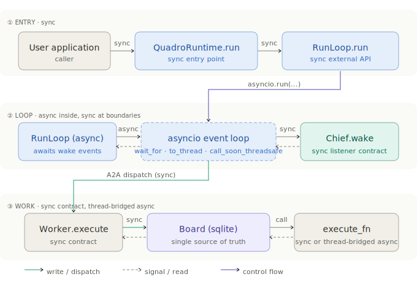

# Concurrency Model

Quadro is small but has four distinct concurrency boundaries. This
document pins each one so that adapter authors and readers of the code
have a single reference.

## The four boundaries

  

1. **User ↔ Runtime** — synchronous. `QuadroRuntime.run()` and
   `RunLoop.run()` are sync entry points. Callers who happen to live
   inside an event loop can use `RunLoop.run_async()` instead.
2. **RunLoop ↔ Chief** — asynchronous inside the loop, synchronous at
   the boundary. The Chief is unchanged — it exposes sync `wake()` and
   sync wake listeners. The async RunLoop drives it via ordinary method
   calls and uses `loop.call_soon_threadsafe` to bridge wake signals
   from worker threads into the loop's `asyncio.Event`.
3. **RunLoop ↔ Sponsor** — synchronous-only contract. The
   `Sponsor.propose_lease(ctx, prior)` Protocol is sync. The async
   RunLoop calls it via `asyncio.to_thread(...)` so blocking sponsors
   (`HttpSponsor`, sync business logic) don't stall the loop. This is
   called out explicitly in `src/quadro/sponsor/sponsors.py:442`.
4. **Worker ↔ execute_fn** — sync at the contract level. The
   `execute_fn(context, board_fn) -> str` signature is synchronous,
   but workers detect coroutines and bridge them by running a private
   asyncio loop on a ThreadPoolExecutor (see
   `src/quadro/agents/worker.py:100-120`). This is how MAF-style `async
   def` execute_fns work without leaking asyncio concerns into the
   worker contract.

## Why the Sponsor Protocol stays sync

Keeping `Sponsor` sync is a deliberate choice — async Sponsors would
cascade async requirements into every composite (`AllOf`, `AnyOf`,
`Priority`) and the test suite. `CallbackSponsor` already documents
this: it wraps an async callable and runs it on a local event loop so
the outer Protocol stays sync.

If Quadro ever ships an async-first Sponsor Protocol, it will be a
parallel `AsyncSponsor` Protocol rather than a breaking change.

## Wake signals under the new loop

The old synchronous loop slept for `poll_interval` between ticks. The
new loop uses an `asyncio.Event`:

- The event is `set()` by the chief wake listener (called from whichever
  thread originally received the wake) via `loop.call_soon_threadsafe`.
- The loop `await`s `asyncio.wait_for(event.wait(), timeout=poll_interval)`
  so it wakes on whichever comes first: a real chief wake or the
  timeout.
- Between ticks the event is cleared and the `TimeoutError` is absorbed.

The practical upshot: a worker that finishes within 50 ms no longer
waits 3 s (the default `poll_interval`) before the sponsor gets a
chance to decide. With `poll_interval=0` the loop becomes a simple
yield — matching the semantics the previous `time.sleep(0)` had in
examples.

See the test `test_chief_wake_preempts_poll_interval` in
`tests/unit/test_run_loop_async.py` for the assertion that pins this.

## Structured logging correlation

The three context variables in `src/quadro/log_context.py` —
`task_id_var`, `chief_cycle_id_var`, `agent_id_var` — are set by the
chief (`_run_decision_cycle`) and by the worker (`_execute_task`). They
propagate across the `asyncio.to_thread` boundary because
`contextvars.copy_context` is what `asyncio` uses under the hood when
scheduling thread work. That means a log record emitted from a sponsor
running in a thread pool still carries the chief cycle ID that
triggered the consult.

Attach `QuadroContextFilter` from the same module to any handler to
materialise these as `quadro_task_id`, `quadro_chief_cycle_id`,
`quadro_agent_id` log record attributes.

## A note on the OTel exporter

The OTel exporter (`src/quadro/integrations/otel.py`) wraps
`ChiefAgent.wake` so that one `quadro.chief_cycle` span covers the full
wake — including the pending-wake replay that the Chief does via its
`_pending_wake` flag. Board events become point-in-time spans emitted
from the Board's `add_event_listener` hook. Both of these hooks
already existed before Phase 2 introduced the exporter; the exporter
is a consumer, not a source, of the coordination record.
