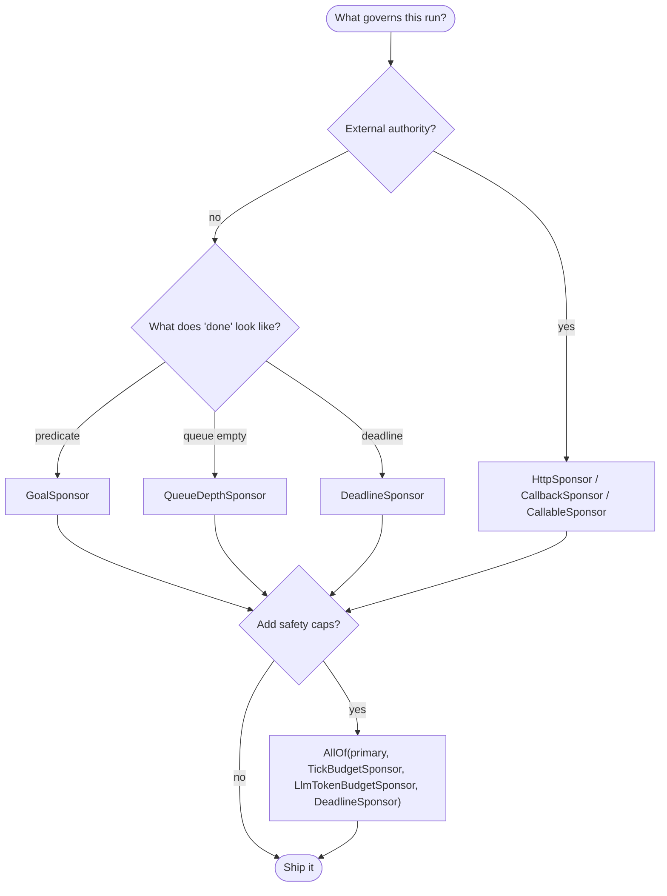

# Sponsor decision matrix

A Sponsor is the external authority that decides whether a Quadro runtime
should keep working. Every consultation returns one of three decisions:
`Continue` (keep going under a `Lease`), `Drain` (no new work, finish
what's in flight), or `Stop` (halt cleanly). This page helps you pick the
right Sponsor — or composition of Sponsors — for your run. For the
protocol itself see [sponsor-authoring.md](sponsor-authoring.md); for the
full design see [docs/design/sponsor.md](../design/sponsor.md).

## Contents

- [Pick a Sponsor in 30 seconds](#pick-a-sponsor-in-30-seconds)
- [Production defaults (cookbook)](#production-defaults-cookbook)
- [Quick-pick matrix](#quick-pick-matrix)
  - [Goal — run until X is done](#goal--run-until-x-is-done)
  - [Tick cap — bound poll ticks](#tick-cap--bound-poll-ticks)
  - [Deadline — wall-clock cut-off](#deadline--wall-clock-cut-off)
  - [LLM cost — bound tokens](#llm-cost--bound-tokens)
  - [Worker budget — bound invocations](#worker-budget--bound-invocations)
  - [Board event budget — bound churn](#board-event-budget--bound-churn)
  - [Multi-axis — bound several things at once](#multi-axis--bound-several-things-at-once)
  - [Queue-driven — drain when backlog clears](#queue-driven--drain-when-backlog-clears)
  - [External authority — HTTP / async / lambda](#external-authority--http--async--lambda)
  - [Primary with fallback](#primary-with-fallback)
  - [Any-of authorities](#any-of-authorities)
- [Consultation cadence (read this once)](#consultation-cadence-read-this-once)
- [fail_open guidance](#fail_open-guidance)
- [Composition rules](#composition-rules)
- [Testing](#testing)
- [See also](#see-also)

## Pick a Sponsor in 30 seconds



## Production defaults (cookbook)

Most real deployments want "run until the mission is done, but never
longer than N minutes, never over M tokens, and never past K poll ticks
just in case". That is an `AllOf` of a primary goal and three safety
caps:

```python
from quadro.sponsor import (
    AllOf,
    DeadlineSponsor,
    GoalSponsor,
    LlmTokenBudgetSponsor,
    TickBudgetSponsor,
)

runtime.sponsor(AllOf(
    GoalSponsor(lambda s: len(s["tasks"]) >= 10),  # primary: are we done?
    DeadlineSponsor.from_now(minutes=30),          # wall-clock belt
    LlmTokenBudgetSponsor(100_000),                # cost belt
    TickBudgetSponsor(1_000),                      # infinite-loop belt
))
```

What each child buys you:

- `GoalSponsor` answers the mission question — `Stop` when done.
- `DeadlineSponsor` protects against slow agents and runaway recursion.
- `LlmTokenBudgetSponsor` puts a hard ceiling on cost.
- `TickBudgetSponsor` is the parity replacement for the old
  `max_cycles=N` and protects against bugs where nothing is progressing.

`AllOf` folds these with an **axis-wise minimum** lease: the runtime
re-consults when whichever child runs out first. If any child returns
`Stop`, the whole composite stops.

## Quick-pick matrix

### Goal — run until X is done

Canonical drop-in replacement for the old `done_when(predicate)`.

```python
from quadro.sponsor import GoalSponsor

runtime.sponsor(GoalSponsor(lambda s: len(s["tasks"]) >= 10))
```

`GoalSponsor` re-checks the predicate every tick by default
(`probe_ticks=1`). See [Consultation cadence](#consultation-cadence-read-this-once)
for why that matters.

### Tick cap — bound poll ticks

Parity replacement for `max_cycles=N` in traditional agentic frameworks.
A "tick" is one poll iteration of the run loop — not an LLM call, not a
worker invocation.

```python
from quadro.sponsor import AllOf, GoalSponsor, TickBudgetSponsor

runtime.sponsor(AllOf(
    GoalSponsor(predicate),
    TickBudgetSponsor(1000),
))
```

### Deadline — wall-clock cut-off

```python
from quadro.sponsor import AllOf, DeadlineSponsor, GoalSponsor

runtime.sponsor(AllOf(
    GoalSponsor(predicate),
    DeadlineSponsor.from_now(minutes=30),
))
```

`DeadlineSponsor.from_now(**timedelta_kwargs)` accepts `seconds`,
`minutes`, `hours`, `days`. For an explicit UTC datetime, construct
`DeadlineSponsor(datetime(...))` directly.

### LLM cost — bound tokens

`LlmTokenBudgetSponsor` caps cumulative LLM token consumption. Usage
flows into the meter via the runtime's shared `MeterBundle`, accessed as
`runtime.meters`:

- **MAF-backed workers** — pass
  `token_reporter=runtime.meters.report_llm_tokens` to `MafReasoner(...)`
  and `MafChiefRuntime(...)`. The adapter extracts `usage` from each MAF
  turn and reports it automatically.
- **Custom workers** — call `runtime.meters.report_llm_tokens(n)`
  from your `execute_fn` closure with whatever token count your
  provider returned.

See `examples/token_budget/` for an end-to-end demo that pairs
this sponsor with `QueueDepthSponsor` against a local OpenAI-compatible
endpoint.

```python
from quadro.sponsor import AllOf, GoalSponsor, LlmTokenBudgetSponsor

runtime.sponsor(AllOf(
    GoalSponsor(pred),
    LlmTokenBudgetSponsor(100_000),
))
```

### Worker budget — bound invocations

`WorkerBudgetSponsor` caps the number of worker calls. Useful when each
worker invocation has a real-world cost (an API call, a slow
computation) and you want a ceiling independent of tokens.

```python
from quadro.sponsor import AllOf, GoalSponsor, WorkerBudgetSponsor

runtime.sponsor(AllOf(
    GoalSponsor(pred),
    WorkerBudgetSponsor(500),
))
```

### Board event budget — bound churn

`BoardEventBudgetSponsor` caps the number of board state transitions —
a proxy for "how much is the system actually doing". Useful for
detecting runaway feedback loops where agents keep poking the board
without making progress.

```python
from quadro.sponsor import AllOf, BoardEventBudgetSponsor, GoalSponsor

runtime.sponsor(AllOf(
    GoalSponsor(pred),
    BoardEventBudgetSponsor(10_000),
))
```

### Multi-axis — bound several things at once

Each budget sponsor only constrains its own axis; leave others `None`
for "unbounded". `AllOf` takes the **axis-wise minimum** across children
and returns a single `Lease` with all axes populated — so the runtime
re-consults on whichever ceiling hits first:

```python
from quadro.sponsor import (
    AllOf,
    DeadlineSponsor,
    GoalSponsor,
    LlmTokenBudgetSponsor,
    TickBudgetSponsor,
    WorkerBudgetSponsor,
)

runtime.sponsor(AllOf(
    GoalSponsor(pred),
    TickBudgetSponsor(1_000),
    DeadlineSponsor.from_now(hours=1),
    LlmTokenBudgetSponsor(250_000),
    WorkerBudgetSponsor(2_000),
))
```

Read this as: "Keep going while the goal is unmet **and** we're under
1000 ticks **and** under 1 hour **and** under 250k tokens **and** under
2000 worker invocations." The first ceiling to hit triggers a
re-consultation; any child returning `Stop` halts the whole composite.

### Queue-driven — drain when backlog clears

Use `QueueDepthSponsor` to work while there's backlog on a named board
data key, then wind down cleanly. By default it returns `Drain` when the
queue is empty, so in-flight work finishes before the runtime stops.
Pass `immediate_stop=True` for a hard halt instead.

```python
from quadro.sponsor import QueueDepthSponsor

runtime.sponsor(QueueDepthSponsor("orders_in_queue", min_depth=1))
```

### External authority — HTTP / async / lambda

When the source of truth lives outside the process, pick by transport:

- `HttpSponsor(url)` — POSTs a JSON body and expects a
  `{decision, reason, lease}` response. Has timeout, retry/backoff,
  and a `fail_open` knob (see below).
- `CallbackSponsor(async_fn)` — wraps an `async` callable for
  in-process integrations (Temporal, Dagster, Prefect workflows).
- `CallableSponsor(sync_fn)` — wraps a plain sync lambda. The quickest
  escape hatch when you need a one-liner policy.

```python
from quadro.sponsor import AllOf, DeadlineSponsor, HttpSponsor

runtime.sponsor(AllOf(
    HttpSponsor(
        "https://crm.example.com/sponsor/ticket-123",
        timeout=5.0,
        max_retries=2,
        fail_open=False,
    ),
    DeadlineSponsor.from_now(hours=8),  # belt-and-braces
))
```

```python
from quadro.sponsor import CallbackSponsor

async def my_temporal_gate(ctx, prior):
    ...  # query a workflow, return Continue/Drain/Stop

runtime.sponsor(CallbackSponsor(my_temporal_gate, timeout=10.0))
```

### Primary with fallback

Use `Priority`: the first child to return a non-`Stop` decision wins
outright; later siblings are not consulted.

```python
from quadro.sponsor import DeadlineSponsor, HttpSponsor, Priority

runtime.sponsor(Priority(
    HttpSponsor("https://crm.example.com/sponsor/ticket-123"),
    DeadlineSponsor.from_now(hours=1),  # consulted only if CRM says Stop
))
```

### Any-of authorities

Use `AnyOf` when any one authority approving is enough to keep running.

```python
from quadro.sponsor import AnyOf, QueueDepthSponsor

runtime.sponsor(AnyOf(
    QueueDepthSponsor("orders_in_queue"),
    QueueDepthSponsor("priority_queue", min_depth=1),
))
```

## Consultation cadence (read this once)

Sponsors are **not** consulted on every poll tick. The runtime only
calls `propose_lease` at:

1. Startup (to get the first lease).
2. Axis exhaustion (any lease axis — ticks, deadline, tokens,
   workers, events — hits its ceiling).
3. Drain-complete (while draining, when no active work remains).

This matters for two reasons:

- A bare `GoalSponsor(predicate)` would only re-check when drain
  completes, which is usually not what you want. That's why the default
  `probe_ticks=1` mints a lease with `ticks=ctx.meters.ticks + 1`, so
  the runtime re-consults every tick. Override with
  `GoalSponsor(pred, probe_ticks=5)` to check less often — useful if
  your predicate is expensive.
- For external Sponsors (HTTP, Callback) the batching is a feature:
  authority checks may be slow or rate-limited, and the framework must
  not DoS the source of truth. Size your lease's `ticks` /
  `deadline` / token ceilings to how stale you can tolerate the
  authority answer being.

## fail_open guidance

Every built-in Sponsor takes a `fail_open` flag (default `False`). The
runtime's error handling is:

- `fail_open=False` (fail-closed): any exception or — for `HttpSponsor`
  — any network error is treated as `Stop`. Safe default for budget,
  deadline, and goal sponsors, which are local and deterministic and
  have no business failing.
- `fail_open=True`: renew the previous lease with a `fail_open_renewal`
  reason, so the runtime keeps running on last-known-good. Only flip
  this on Sponsors that depend on a potentially flaky external system
  (`HttpSponsor` against a jittery CRM, `CallbackSponsor` wrapping a
  workflow engine) where a transient blip should not kill the run.

Rule of thumb: pair `fail_open=True` with a sibling `DeadlineSponsor`
inside an `AllOf`. The deadline is your belt: even if the flaky
authority never comes back, the run is still bounded.

## Composition rules

Every composer is itself a Sponsor, so they nest arbitrarily. The
per-decision folding rules:

`AllOf` — every child must agree; axis-wise **minimum** lease:

| AllOf            | Continue | Drain    | Stop |
|------------------|----------|----------|------|
| **Continue**     | Continue | Drain    | Stop |
| **Drain**        | Drain    | Drain    | Stop |
| **Stop**         | Stop     | Stop     | Stop |

`AnyOf` — any one child may authorise; axis-wise **maximum** lease
(where `None` means "unbounded" and dominates):

| AnyOf            | Continue | Drain    | Stop     |
|------------------|----------|----------|----------|
| **Continue**     | Continue | Continue | Continue |
| **Drain**        | Continue | Drain    | Drain    |
| **Stop**         | Continue | Drain    | Stop     |

`Priority` — cascade in declaration order. The first child to return a
non-`Stop` decision wins outright; later children are not consulted. If
every child returns `Stop`, the composite returns `Stop`.

## Testing

Three fixture Sponsors in `quadro.sponsor` cover most integration-test
needs without mocking.

`ScriptedSponsor` — deterministic sequence of decisions. Safe to use in
production for replay-style debugging.

```python
from quadro.sponsor import Continue, Drain, Lease, ScriptedSponsor, Stop

sponsor = ScriptedSponsor([
    Continue(lease=Lease(ticks=2)),
    Continue(lease=Lease(ticks=2)),
    Drain(deadline=None, reason="test_drain"),
    Stop(reason="test_stop"),
])
```

Exhausting the script returns `Stop(reason="script_exhausted")` by
default; override with `ScriptedSponsor(script, default=...)`.

`AlwaysOnSponsor` — `Continue` forever with an unbounded lease. Useful
as a baseline when testing that the *other* child of a composite
terminates the run correctly:

```python
from quadro.sponsor import AllOf, AlwaysOnSponsor, TickBudgetSponsor

runtime.sponsor(AllOf(AlwaysOnSponsor(), TickBudgetSponsor(5)))
# Should stop after 5 ticks because the tick budget is the only real constraint.
```

`AlwaysStopSponsor` — `Stop` on the first consultation. Sanity-check
termination paths and shutdown hooks.

```python
from quadro.sponsor import AlwaysStopSponsor

runtime.sponsor(AlwaysStopSponsor(reason="smoke_test"))
```

For fully hand-rolled tests, construct a `SponsorContext` directly and
call `propose_lease`. See [sponsor-authoring.md](sponsor-authoring.md#testing-your-sponsor).

## See also

- [sponsor-authoring.md](sponsor-authoring.md) — how to write your own
  Sponsor (protocol, context fields, error handling).
- [docs/design/sponsor.md](../design/sponsor.md) — full design
  rationale, locked API, non-goals.
- [examples/crm_sponsor/README.md](../../examples/crm_sponsor/README.md)
  — end-to-end example of delegating runtime lifetime to a CRM ticket.
