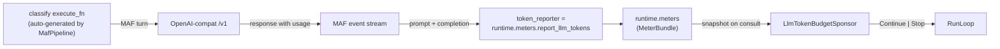

# LLM token-budget demo

This example answers the question reviewers always ask: **"how do I stop
this from burning my LLM budget?"**

> **See [`output_sample/REPORT.md`](output_sample/REPORT.md)** for what a real
> run produces — two runs of this code against OpenAI `gpt-5.4` with budgets of
> `50,000` and `500`, showing the full 38-step sponsor decision chain, every
> classifier output, and the exact tokens burned. One click, no setup.

A queue of 15 support tickets is triaged by a single MAF-backed
classifier stage. The whole run is governed by an `AllOf` composition of
three sponsors:

| Sponsor | Role | What it watches |
|---|---|---|
| `QueueDepthSponsor("tickets_queue")` | Primary | Board data key kept in sync with pending tasks |
| `LlmTokenBudgetSponsor(LLM_BUDGET)` | The star | Cumulative `prompt + completion` tokens from every MAF call |
| `DeadlineSponsor.from_now(minutes=3)` | Safety rail | Wall-clock cut-off |

`AllOf` folds the three decisions with an axis-wise minimum lease —
the runtime re-consults as soon as the tightest ceiling is hit, and
any `Stop` from any child halts the whole composite. See
[docs/guides/sponsor-decision-matrix.md](../../../docs/guides/sponsor-decision-matrix.md)
for the full rules.

## Run it twice

Copy `.env.example` to `.env` and set `OPENAI_API_KEY` /
`OPENAI_MODEL_ID` / `OPENAI_BASE_URL` for whichever OpenAI-compatible
endpoint you want — OpenAI proper, local Ollama, local
vLLM/SGLang/LiteLLM, or anything else that speaks `/v1/chat/completions`.

```bash
cp .env.example .env
python main.py                       # default LLM_BUDGET=5000

LLM_BUDGET=50000 python main.py      # queue empties first  -> Drain
LLM_BUDGET=500   python main.py      # budget trips first   -> Stop
```

Two runs, one binary, two termination paths. That's the money shot.

Add `--output-dir output/generous` (or `.../tight`) to either invocation and
you'll also get a committable `run.json` artefact — see
[Output artefacts](#output-artefacts).

### Run 1 — `LLM_BUDGET=50000` (queue empties, graceful drain)

```text
LLM token-budget demo — tickets=15  budget=50000  model=gpt-5.4
[cycle  0] tickets= 0/15 (failed=0 active=3 pending=15)  tokens=[........................]   398/50000  lease=all_of
[cycle  8] tickets= 4/15 (failed=0 active=2 pending=11)  tokens=[#.......................]  2549/50000  lease=all_of
[cycle 16] tickets= 8/15 (failed=0 active=1 pending= 7)  tokens=[##......................]  5040/50000  lease=all_of
[cycle 24] tickets=12/15 (failed=0 active=1 pending= 3)  tokens=[####....................]  7557/50000  lease=all_of
[cycle 32] tickets=13/15 (failed=0 active=2 pending= 2)  tokens=[####....................]  9126/50000  lease=all_of
[cycle 37] tickets=15/15 (failed=0 active=0 pending= 0)  tokens=[#####...................] 10346/50000  lease=all_of  (DRAINING)
RunLoop: drain complete (no active tasks)

========================================================================
  LLM token-budget demo complete
========================================================================
  Classified: 15/15   (failed=0)
  Tokens used: 10623 / 50000
  Wall time:   16.0s
  Sponsor decisions (last 8):
    continue  'all_of:queue_depth:3>=1 & llm_tokens_budget:8814/50000 & deadline:...'   @  8814 tok
    continue  'all_of:queue_depth:2>=1 & llm_tokens_budget:8814/50000 & deadline:...'   @  8814 tok
    continue  'all_of:queue_depth:2>=1 & llm_tokens_budget:9126/50000 & deadline:...'   @  9126 tok
    continue  'all_of:queue_depth:2>=1 & llm_tokens_budget:9126/50000 & deadline:...'   @  9126 tok
    continue  'all_of:queue_depth:2>=1 & llm_tokens_budget:9570/50000 & deadline:...'   @  9570 tok
    continue  'all_of:queue_depth:1>=1 & llm_tokens_budget:9865/50000 & deadline:...'   @  9865 tok
    continue  'all_of:queue_depth:1>=1 & llm_tokens_budget:10346/50000 & deadline:...'  @ 10346 tok
    drain     'all_of:queue_empty:tickets_queue'                  @ 10346 tok
========================================================================
```

*(Only 6 of the 38 cycle ticks shown for brevity — see
[`output_sample/REPORT.md`](output_sample/REPORT.md) for the full
decision chain.)*

All 15 tickets classified in roughly a fifth of the budget. The queue
drained first, so the sponsor returned `Drain`; `RunLoop` let the last
in-flight classifiers finish, then auto-stopped.

### Run 2 — `LLM_BUDGET=500` (budget trips first, hard stop)

```text
LLM token-budget demo — tickets=15  budget=500  model=gpt-5.4
[cycle  0] tickets= 0/15 (failed=0 active=3 pending=15)  tokens=[###################.....]   403/500  lease=all_of
[cycle  1] tickets= 0/15 (failed=0 active=3 pending=15)  tokens=[###################.....]   403/500  lease=all_of
[cycle  2] tickets= 1/15 (failed=0 active=2 pending=14)  tokens=[###################.....]   403/500  lease=all_of

========================================================================
  LLM token-budget demo complete
========================================================================
  Classified: 1/15   (failed=0)
  Tokens used: 829 / 500
  Wall time:   2.3s
  Sponsor decisions (last 4):
    continue  'all_of:queue_depth:15>=1 & llm_tokens_budget:403/500 & deadline:...'  @   403 tok
    continue  'all_of:queue_depth:15>=1 & llm_tokens_budget:403/500 & deadline:...'  @   403 tok
    continue  'all_of:queue_depth:15>=1 & llm_tokens_budget:403/500 & deadline:...'  @   403 tok
    stop      'all_of:llm_tokens_budget_exhausted:829/500'        @   829 tok
========================================================================
```

The sponsor sampled `403 / 500` on three consecutive consultations
(in-flight calls hadn't reported yet), then the returning calls pushed
the meter to `829`, blowing the budget. Next consultation: `Stop`. The
overshoot (`829 > 500`) is the cost of concurrency — three workers had
already committed their turns when the sponsor looked. Shrink
`workers` or pick a tighter budget to taste. The point: **the run halts
on cost, predictably, and reports why**.

Exit codes: the script returns `2` when the budget stops the run and
`0` when the queue drains naturally, so CI or operators can tell the
two apart.

## How the budget is enforced



Three pieces cooperate:

1. `QuadroRuntime.meters` is a shared `MeterBundle`. Every runtime has
   one, lazily constructed on first read.
2. `MafPipeline.llm(token_reporter=runtime.meters.report_llm_tokens)`
   tells the MAF adapter to extract `usage` from every turn (chief and
   classifier) and push `prompt_tokens + completion_tokens` into that
   bundle.
3. `LlmTokenBudgetSponsor(N)` reads `ctx.meters.llm_tokens` on each
   consultation. When it exceeds `N`, it returns `Stop`.

That's it — a three-line wiring chain that makes the sponsor load-bearing.

## Wiring your own provider

Anything that speaks OpenAI-compat works. Change only the three env
vars; the code is untouched.

- **OpenAI proper** — `OPENAI_BASE_URL=https://api.openai.com/v1`,
  a real `OPENAI_API_KEY`, and whichever model you prefer.
- **Local Ollama** — `OPENAI_BASE_URL=http://localhost:11434/v1`,
  `OPENAI_API_KEY=ollama`, `OPENAI_MODEL_ID=llama3.2` (or any pulled
  model).
- **vLLM / SGLang / LiteLLM** — same shape; use whatever URL your
  deployment exposes, plus the model id it serves.

Token usage extraction is defensive: the MAF adapter probes a few
`usage` field shapes (`prompt_tokens`/`completion_tokens`,
`input_tokens`/`output_tokens`, `total_tokens`) and silently reports 0
when the provider doesn't surface usage at all. Telemetry never fails a
worker.

## Output artefacts

Pass `--output-dir <path>` and the script serialises a `run.json` at
the end of the run — `meta` (budget / model / endpoint / wall time /
final decision), `summary` (classified / tokens / utilisation), the
full `sponsor_log` decision chain, and every ticket with its parsed
`TicketTag`.

Render two `run.json`s into a single `REPORT.md` with the companion
script (pure stdlib, no MAF dependency):

```bash
LLM_BUDGET=50000 python main.py --output-dir output/generous
LLM_BUDGET=500   python main.py --output-dir output/tight

python render_report.py \
    --generous output/generous/run.json \
    --tight    output/tight/run.json \
    --out      output/REPORT.md
```

The committed [`output_sample/`](output_sample/) is exactly the result
of running that recipe against `gpt-5.4`, for anyone who wants to see
what the example produces without setting up the keys.

## Why this is a good sponsor-story

- **Load-bearing budget**: the `LlmTokenBudgetSponsor` genuinely
  terminates the run when the ceiling is hit — not a decoration.
- **Graceful wind-down vs. hard stop**: swapping the env var reveals
  both shapes (`Drain` when the queue empties, `Stop` when the budget
  trips). That maps straight onto the production cookbook in the
  [Sponsor decision matrix](../../../docs/guides/sponsor-decision-matrix.md#production-defaults-cookbook).
- **Telemetry you can see**: the live progress bar reads from the
  already-published `_sponsor_status` key on the board; no custom
  instrumentation needed.
- **Portable**: one `.env` change points the same code at OpenAI,
  Ollama, or any OpenAI-compat endpoint.
