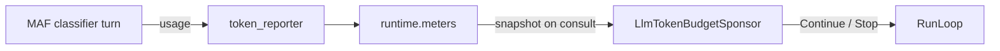

# Token-Budget Run Report

*Real runs of `examples/microsoft_agent_framework/llm_token_budget/main.py` against `gpt-5.4` at `https://api.openai.com/v1`.*

## Two runs, one binary, two termination paths

| Run      | Budget  | Classified | Tokens used       | Decision | Wall time | Reason |
|----------|--------:|-----------:|------------------:|:---------|----------:|:-------|
| Generous |  50,000 | 15 / 15 |  10,623 ( 21.2%) | Drain    |  16.0 s | all_of:queue_empty:tickets_queue |
| Tight    |     500 |  1 / 15 |     829 (165.8%) | Stop     |   2.3 s | all_of:llm_tokens_budget_exhausted:829/500 |

The **generous** run classified all 15 tickets spending only **21.2%** of the budget; the **tight** run was stopped by the sponsor at **829 tokens** (165.8% of its `500` budget — the overshoot is the cost of concurrency: workers already in flight when the sponsor sampled below the ceiling). Both outcomes come from the same `AllOf(QueueDepthSponsor, LlmTokenBudgetSponsor, DeadlineSponsor)` composition; only `LLM_BUDGET` differs.

## Run 1 — Generous

- **Budget:** `50,000` tokens
- **Final decision:** `drain`
- **Wall time:** 16.0 s
- **Classified:** 15 / 15 (0 failed)
- **Generated:** 2026-04-26T02:30:21+00:00

### Token usage

```
[########............................]  10,623 / 50,000  (21.2%)
```

### Sponsor decision chain

| Cycle | Decision | Tokens at | Reason |
|------:|:---------|----------:|:-------|
|     0 | continue |       398 | queue_depth:15>=1 & llm_tokens_budget:398/50000 |
|     1 | continue |       398 | queue_depth:15>=1 & llm_tokens_budget:398/50000 |
|     2 | continue |       841 | queue_depth:15>=1 & llm_tokens_budget:841/50000 |
|     3 | continue |     1,286 | queue_depth:14>=1 & llm_tokens_budget:1286/50000 |
|     4 | continue |     1,286 | queue_depth:13>=1 & llm_tokens_budget:1286/50000 |
|     5 | continue |     1,709 | queue_depth:13>=1 & llm_tokens_budget:1709/50000 |
|     6 | continue |     1,709 | queue_depth:12>=1 & llm_tokens_budget:1709/50000 |
|     7 | continue |     2,103 | queue_depth:12>=1 & llm_tokens_budget:2103/50000 |
|     8 | continue |     2,549 | queue_depth:12>=1 & llm_tokens_budget:2549/50000 |
|     9 | continue |     2,549 | queue_depth:11>=1 & llm_tokens_budget:2549/50000 |
|    10 | continue |     3,367 | queue_depth:11>=1 & llm_tokens_budget:3367/50000 |
|    11 | continue |     3,367 | queue_depth:10>=1 & llm_tokens_budget:3367/50000 |
|    12 | continue |     3,797 | queue_depth:10>=1 & llm_tokens_budget:3797/50000 |
|    13 | continue |     4,195 | queue_depth:9>=1 & llm_tokens_budget:4195/50000 |
|    14 | continue |     4,195 | queue_depth:9>=1 & llm_tokens_budget:4195/50000 |
|    15 | continue |     4,195 | queue_depth:9>=1 & llm_tokens_budget:4195/50000 |
|    16 | continue |     5,040 | queue_depth:9>=1 & llm_tokens_budget:5040/50000 |
|    17 | continue |     5,469 | queue_depth:8>=1 & llm_tokens_budget:5469/50000 |
|    18 | continue |     5,919 | queue_depth:7>=1 & llm_tokens_budget:5919/50000 |
|    19 | continue |     6,324 | queue_depth:6>=1 & llm_tokens_budget:6324/50000 |
|    20 | continue |     6,324 | queue_depth:6>=1 & llm_tokens_budget:6324/50000 |
|    21 | continue |     6,691 | queue_depth:6>=1 & llm_tokens_budget:6691/50000 |
|    22 | continue |     6,691 | queue_depth:6>=1 & llm_tokens_budget:6691/50000 |
|    23 | continue |     7,100 | queue_depth:6>=1 & llm_tokens_budget:7100/50000 |
|    24 | continue |     7,557 | queue_depth:5>=1 & llm_tokens_budget:7557/50000 |
|    25 | continue |     8,003 | queue_depth:4>=1 & llm_tokens_budget:8003/50000 |
|    26 | continue |     8,003 | queue_depth:3>=1 & llm_tokens_budget:8003/50000 |
|    27 | continue |     8,003 | queue_depth:3>=1 & llm_tokens_budget:8003/50000 |
|    28 | continue |     8,354 | queue_depth:3>=1 & llm_tokens_budget:8354/50000 |
|    29 | continue |     8,354 | queue_depth:3>=1 & llm_tokens_budget:8354/50000 |
|    30 | continue |     8,814 | queue_depth:3>=1 & llm_tokens_budget:8814/50000 |
|    31 | continue |     8,814 | queue_depth:2>=1 & llm_tokens_budget:8814/50000 |
|    32 | continue |     9,126 | queue_depth:2>=1 & llm_tokens_budget:9126/50000 |
|    33 | continue |     9,126 | queue_depth:2>=1 & llm_tokens_budget:9126/50000 |
|    34 | continue |     9,570 | queue_depth:2>=1 & llm_tokens_budget:9570/50000 |
|    35 | continue |     9,865 | queue_depth:1>=1 & llm_tokens_budget:9865/50000 |
|    36 | continue |    10,346 | queue_depth:1>=1 & llm_tokens_budget:10346/50000 |
|    37 | drain    |    10,346 | queue_empty:tickets_queue |

### Classifier outputs

| Ticket | Urgency  | Category         | Suggested reply (truncated) |
|:-------|:---------|:-----------------|:----------------------------|
| T-001  | high     | account          | Hi Marcus — sorry you’re running into this. Since password resets h… |
| T-002  | medium   | billing          | Thanks for reaching out about the March invoice. I understand the u… |
| T-003  | low      | feature_request  | Thanks for the feedback — exporting the full quarter’s activity log… |
| T-004  | critical | outage           | Thanks for flagging this — we understand your checkout flow is fail… |
| T-005  | low      | other            | Thanks so much for the kind words—we’re glad the new dashboard is u… |
| T-006  | low      | feature_request  | Thanks for reaching out — I can help clarify our SAML capabilities.… |
| T-007  | medium   | billing          | Thanks for flagging this, and I’m sorry about the duplicate charge.… |
| T-008  | medium   | other            | Thanks for flagging this — I’m sorry you’re running into 429s on /v… |
| T-009  | high     | account          | Sorry you’re locked out and not receiving the unlock email. We can… |
| T-010  | high     | other            | Thanks for flagging this again, and I’m sorry you’ve had to chase i… |
| T-011  | low      | feature_request  | Thanks for the feedback—we understand dark mode would make the expe… |
| T-012  | medium   | billing          | Thanks for the update — we can help change the billing address on y… |
| T-013  | critical | account          | Thanks for flagging this — we’re reviewing the sign-in activity and… |
| T-014  | low      | billing          | Thanks for reaching out — we’d be happy to share enterprise pricing… |
| T-015  | low      | feature_request  | Thanks for the detailed feedback — I can see how the current webhoo… |

## Run 2 — Tight

- **Budget:** `500` tokens
- **Final decision:** `stop`
- **Wall time:** 2.3 s
- **Classified:** 1 / 15 (0 failed)
- **Generated:** 2026-04-26T02:30:53+00:00

### Token usage

```
[####################################]  829 / 500  (165.8%)
```

### Sponsor decision chain

| Cycle | Decision | Tokens at | Reason |
|------:|:---------|----------:|:-------|
|     0 | continue |       403 | queue_depth:15>=1 & llm_tokens_budget:403/500 |
|     1 | continue |       403 | queue_depth:15>=1 & llm_tokens_budget:403/500 |
|     2 | continue |       403 | queue_depth:15>=1 & llm_tokens_budget:403/500 |
|     3 | stop     |       829 | llm_tokens_budget_exhausted:829/500 |

### Classifier outputs

| Ticket | Urgency  | Category         | Suggested reply (truncated) |
|:-------|:---------|:-----------------|:----------------------------|
| T-001  | -        | -                | _(not reached: status=classifying)_ |
| T-002  | medium   | billing          | Thanks for reaching out about the March invoice. I understand the u… |
| T-003  | -        | -                | _(not reached: status=classifying)_ |
| T-004  | -        | -                | _(not reached: status=UNASSIGNED)_ |
| T-005  | -        | -                | _(not reached: status=UNASSIGNED)_ |
| T-006  | -        | -                | _(not reached: status=UNASSIGNED)_ |
| T-007  | -        | -                | _(not reached: status=UNASSIGNED)_ |
| T-008  | -        | -                | _(not reached: status=UNASSIGNED)_ |
| T-009  | -        | -                | _(not reached: status=UNASSIGNED)_ |
| T-010  | -        | -                | _(not reached: status=UNASSIGNED)_ |
| T-011  | -        | -                | _(not reached: status=UNASSIGNED)_ |
| T-012  | -        | -                | _(not reached: status=UNASSIGNED)_ |
| T-013  | -        | -                | _(not reached: status=UNASSIGNED)_ |
| T-014  | -        | -                | _(not reached: status=UNASSIGNED)_ |
| T-015  | -        | -                | _(not reached: status=UNASSIGNED)_ |

## How tokens reach the sponsor



Every MAF turn (chief and classifier) emits a `usage` record in
its event stream. The adapter extracts `prompt_tokens +
completion_tokens` and calls the `token_reporter` you wired via
`MafPipeline.llm(token_reporter=runtime.meters.report_llm_tokens)`.
`LlmTokenBudgetSponsor` reads `ctx.meters.llm_tokens` on each
consultation and halts the run when cumulative usage exceeds
the budget.

See [../README.md](../README.md) for the wiring details and
[../../../../docs/guides/sponsor-decision-matrix.md](../../../../docs/guides/sponsor-decision-matrix.md)
for the full sponsor cookbook.

## Reproduce

```bash
cp .env.example .env            # set OPENAI_API_KEY / _MODEL_ID / _BASE_URL

LLM_BUDGET=50000 python main.py --output-dir output/generous
LLM_BUDGET=500   python main.py --output-dir output/tight

python render_report.py \
    --generous output/generous/run.json \
    --tight    output/tight/run.json \
    --out      output/REPORT.md
```

