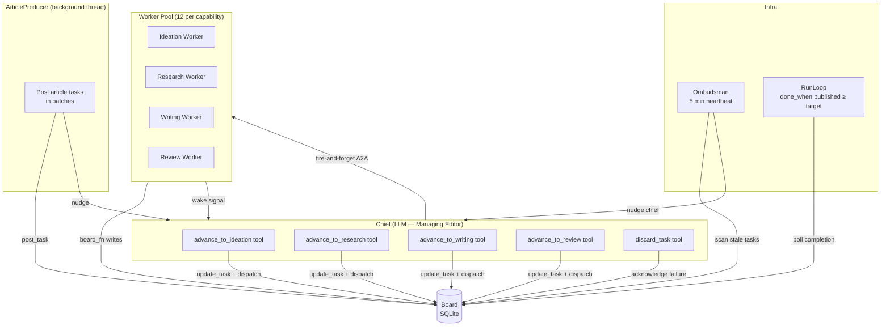
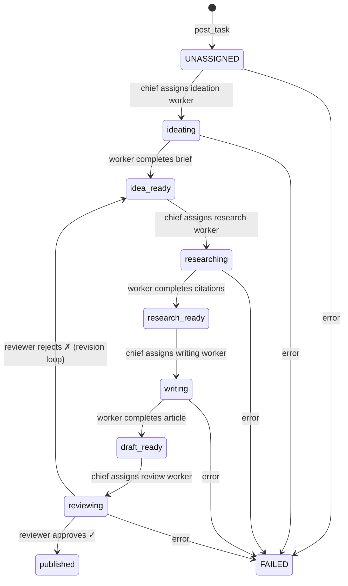
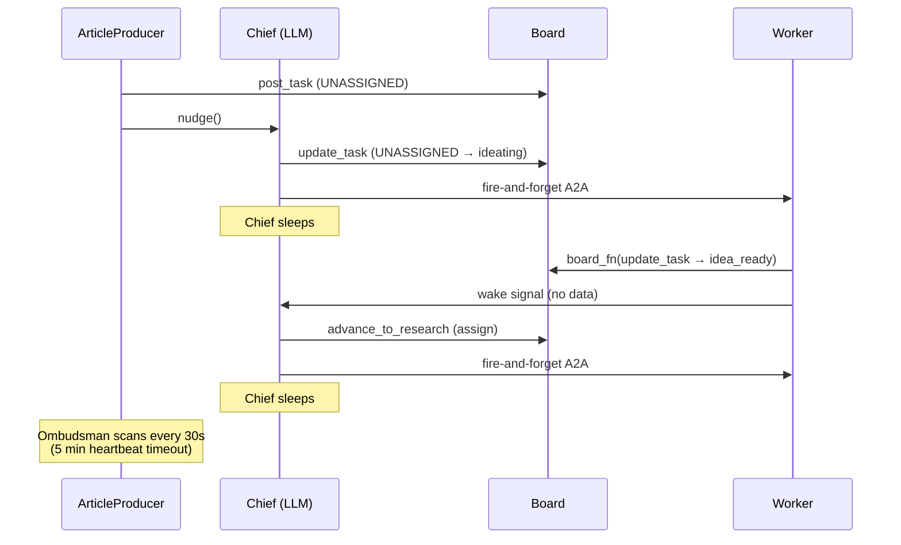

# LLM Newsroom — Multi-Stage Article Pipeline

Multi-agent health newsroom that produces long-form articles through a
four-stage pipeline: **ideation**, **research** (with PubMed), **writing**, and
**editorial review**. An LLM chief coordinates the pipeline using board tools
while a background producer feeds article tasks onto the board.

This example demonstrates Quadro's coordination patterns with an **LLM-driven
chief**, a **custom multi-stage lifecycle profile**, **reactive wakeup**, a
**revision loop** where rejected drafts cycle back for rework, and an
**ArticleProducer** that decouples task creation from task routing.

---

## The use case

> A health publication wants to produce evidence-based articles on topics like
> sleep science, gut health, and cardiovascular fitness. The editorial process is
> structured: an article producer posts topics onto the board, a managing editor
> (LLM chief) routes them through the pipeline, an ideation desk pitches article
> briefs, a research desk gathers PubMed citations, a writing desk produces
> long-form drafts, and a review desk either approves for publication or sends
> the piece back for rework.
>
> No single person — or single LLM call — can do all of this. The work is
> inherently multi-stage, multi-agent, and governed: every article must pass
> through every stage, every transition is validated, and the full audit trail
> is preserved.

This newsroom models a **real editorial pipeline** as a Quadro coordination
problem. The managing editor is an LLM chief with board tools. The four desks
are LLM worker pools. The board enforces the lifecycle — articles cannot skip
stages, reviewers can reject drafts back into the pipeline, and the ombudsman
catches workers that go silent.

The `ArticleProducer` runs in a background thread and posts article tasks in
configurable batches — either uniform intervals or explicit choreographies. The
chief never creates articles; it only routes what the producer has posted.

**What makes this interesting as a Quadro example:**

- The chief is an **LLM with tools**, not a hardcoded router — it reads the
  board and decides what to do, but the board constrains what it *can* do.
- The **revision loop** (`reviewing → idea_ready`) means articles can cycle
  through the pipeline multiple times before publication.
- **PubMed integration** in the research stage shows workers calling external
  APIs during execution, not just generating text.
- **Reactive wakeup** means the chief is not called on a timer — workers signal
  it after every board write, and the ombudsman provides a safety net.
- **Producer/chief separation** keeps task creation independent from task
  routing, so the chief's LLM cycles focus entirely on pipeline advancement.

---

## Architecture

### System overview



### Article lifecycle profile

Each article task follows a nine-stage custom lifecycle. The review stage can
loop back to `idea_ready` for revision — rejected drafts re-enter the pipeline
from the ideation stage.



### Reactive wakeup sequence

The chief is **not** polled every cycle. Workers signal the chief after every
board write, and the chief dispatches all actionable tasks in a single pass.



### Agent roles

| Agent | Type | Role |
|-------|------|------|
| **Chief** | LLM (managing editor) | Reads board, advances pipeline stages, dispatches workers |
| **ArticleProducer** | Background thread | Posts article tasks in batches, nudges chief |
| **Ideation** workers | LLM | Generate structured article briefs (JSON `ArticleBrief`) from topic hints |
| **Research** workers | LLM + PubMed | Build research strategy, query NCBI PubMed, compile citations |
| **Writing** workers | LLM | Produce long-form markdown articles from brief + research |
| **Review** workers | LLM | Editorial gate — approve for publication or send back for revision |
| **Ombudsman** | Timer | Detects stale workers (5 min heartbeat timeout) |

### Chief tools

The chief LLM has five board-aware tools. All worker dispatches are
fire-and-forget (daemon threads) to avoid blocking the chief's decision cycle.

| Tool | Description |
|------|-------------|
| `advance_to_ideation` | Dispatches all `UNASSIGNED` articles to ideation workers (respects capacity) |
| `advance_to_research` | Moves all `idea_ready` tasks to research |
| `advance_to_writing` | Moves all `research_ready` tasks to writing |
| `advance_to_review` | Moves all `draft_ready` tasks to review |
| `discard_task` | Acknowledges a `HUMAN_REVIEW` task so it stops appearing in dispatch lists |

The chief policy also includes a **mechanical first pass** that dispatches
`UNASSIGNED` tasks to ideation without an LLM call — only the remaining
pipeline stages (idea_ready → research, research_ready → writing, draft_ready →
review) go through the LLM.

---

## File structure

```
newsroom/
├── main.py              Entry point — board, pool, chief, producer, ombudsman, run loop
├── agents.py            Worker execute_fns + chief policy builder
├── tools.py             Chief board tools (advance_to_*, discard_task)
├── schemas.py           Pydantic models (ArticleBrief, ResearchOutput, etc.)
├── producer.py          ArticleProducer — background task feeder
├── docker/              Docker setup — see Running with Docker below
├── prompts/
│   ├── chief.md         Managing editor system prompt
│   ├── ideation.md      Article brief generation
│   ├── research.md      PubMed research strategy
│   ├── writing.md       Long-form article writing
│   └── review.md        Editorial review gate
└── output/              Published markdown articles + JSON flight plans (created at runtime)
```

---

## Prerequisites

1. **Quadro** installed (or run from the repo root so `src/` is on the path):

   ```bash
   pip install -e .
   ```

2. **Microsoft Agent Framework** and **Pydantic** installed:

   ```bash
   pip install agent-framework pydantic python-dotenv
   ```

3. **LLM server** running an OpenAI-compatible API. Configure via environment
   variables or a `.env` file (see [Configuration](#configuration)):

   ```bash
   export OPENAI_API_KEY=your-key
   export OPENAI_BASE_URL=https://api.openai.com/v1
   export OPENAI_MODEL_ID=gpt-4.1
   ```

   Or use a local model server (Ollama, sglang, vLLM, etc.) at any
   OpenAI-compatible endpoint.

4. **Network access** to PubMed ([NCBI E-utilities](https://www.ncbi.nlm.nih.gov/books/NBK25501/)) for the research stage.

---

## Running locally

From the repo root:

```bash
# Default: 5 articles, up to 500 chief cycles
python examples/microsoft_agent_framework/newsroom/main.py

# Quick single-article run
python examples/microsoft_agent_framework/newsroom/main.py --target 1

# Larger run with more cycles
python examples/microsoft_agent_framework/newsroom/main.py --target 10 --cycles 1000

# Named choreography (batched article posting)
python examples/microsoft_agent_framework/newsroom/main.py --choreography sleep_study
```

### Board UI

In a second terminal while the newsroom is running:

```bash
python -m quadro.ui examples/microsoft_agent_framework/newsroom/newsroom.db
```

Open <http://localhost:8080> to see the live Kanban view with all pipeline
stages as columns.

### Starting fresh

Delete `newsroom.db` and the `output/` directory to reset:

```bash
rm -f examples/microsoft_agent_framework/newsroom/newsroom.db
rm -rf examples/microsoft_agent_framework/newsroom/output/
```

---

## Running with Docker

The `docker/` folder contains a self-contained setup that runs the newsroom and
the Board UI together in a single container. It supports two LLM providers:
**Ollama** (local, default) and **OpenAI** (or any OpenAI-compatible API).

**What it does:**
- Starts the newsroom pipeline as the foreground process
- Starts the Board UI as a background process inside the same container
- Exposes the Board UI on port 8080
- Creates a fresh `newsroom.db` on every container start
- Bind-mounts `src/quadro` and the example source for live code reloading
- When `LLM_PROVIDER=ollama`: waits for Ollama health and pulls the model
- When `LLM_PROVIDER=openai`: validates `OPENAI_API_KEY` and skips Ollama setup

### Quick start

```bash
cd examples/microsoft_agent_framework/newsroom/docker

# Copy and edit configuration (set your LLM provider and API key)
cp .env.example .env

# Start (default: 5 articles)
./up.sh

# Start with custom target
./up.sh --target 10
./up.sh --target 3 --cycles 200
./up.sh --choreography sleep_study
```

**Windows (PowerShell):**

```powershell
cd examples\microsoft_agent_framework\newsroom\docker
.\up.ps1
.\up.ps1 -Target 10
.\up.ps1 -Target 3 -Cycles 200
.\up.ps1 -Choreography sleep_study
```

### Board UI

While the newsroom is running, open <http://localhost:8080> in any browser.
The Kanban view updates live as articles move through the pipeline.

### Stopping

```bash
./down.sh            # stop containers, keep volumes
./down.sh --clean    # stop and remove all volumes (full reset)
```

**Windows:**

```powershell
.\down.ps1           # stop containers, keep volumes
.\down.ps1 -Clean    # stop and remove all volumes (full reset)
```

### Debug mode

A debug compose file launches the newsroom under
[debugpy](https://github.com/microsoft/debugpy), waiting for VS Code / Cursor
to attach on port 5678.

**Step 1 — Start the debug container:**

```bash
cd examples/microsoft_agent_framework/newsroom/docker
docker compose -f docker-compose.debug.yml up --build
```

Wait for the log line:

```
[debug-entrypoint] debugpy listening on 0.0.0.0:5678 — WAITING for debugger to attach ...
```

**Step 2 — Attach the debugger:**

The repo includes a `.vscode/launch.json` with pre-configured debug profiles.
Open the **Run and Debug** panel (Ctrl+Shift+D), select **"Attach: Newsroom
Docker"**, and press F5.

There is also a **"Launch: Newsroom Local"** config for debugging without
Docker — it runs `main.py` directly on the host with `--target 1`.

Source code is bind-mounted into the container, so breakpoints in
`src/quadro/`, `examples/microsoft_agent_framework/newsroom/`, and
`examples/microsoft_agent_framework/shared.py` all work without rebuilding.
The Board UI is available at <http://localhost:8080> while debugging.

Set `DEBUGPY_WAIT=0` in your `.env` to skip waiting for the debugger (debugpy
still listens, so you can attach later).

### Configuration

All parameters are set via environment variables. Copy `.env.example` to `.env`
and edit as needed:

| Variable | Default | Description |
|---|---|---|
| `LLM_PROVIDER` | `ollama` | `"ollama"` or `"openai"` — controls entrypoint behaviour |
| `NEWSROOM_TARGET` | `5` | Number of articles to publish |
| `NEWSROOM_CYCLES` | `500` | Maximum chief decision cycles |
| `NEWSROOM_CHOREOGRAPHY` | _(empty)_ | Named choreography: `sleep_study` or `wave_study` |
| `OLLAMA_MODEL` | `gpt-oss:20b` | Model for Ollama to pull and serve |
| `OLLAMA_BASE_URL` | `http://localhost:11434` | Ollama API endpoint |
| `OPENAI_API_KEY` | `ollama` | API key (required when `LLM_PROVIDER=openai`) |
| `OPENAI_BASE_URL` | `http://localhost:11434/v1` | OpenAI-compatible base URL |
| `OPENAI_MODEL_ID` | `gpt-oss:20b` | Model identifier passed to the client |
| `UI_PORT` | `8080` | Host port for the Board UI |

Variables can also be passed inline without editing `.env`:

```bash
NEWSROOM_TARGET=20 NEWSROOM_CYCLES=1000 ./up.sh
```

**Example: using OpenAI directly**

```env
LLM_PROVIDER=openai
OPENAI_API_KEY=sk-your-key-here
OPENAI_BASE_URL=https://api.openai.com/v1
OPENAI_MODEL_ID=gpt-4.1
```

**Example: using a local Ollama instance**

```env
LLM_PROVIDER=ollama
OLLAMA_MODEL=gpt-oss:20b
OPENAI_API_KEY=ollama
OPENAI_BASE_URL=http://localhost:11434/v1
OPENAI_MODEL_ID=gpt-oss:20b
```

### Docker file structure

```
docker/
├── Dockerfile               Single-container image (newsroom + Board UI)
├── docker-compose.yml       Newsroom service with network_mode: host
├── docker-compose.debug.yml Debug variant — debugpy on port 5678
├── entrypoint.sh            Startup: wait for LLM → clean DB → start UI → run pipeline
├── entrypoint.debug.sh      Debug startup: same + debugpy --wait-for-client
├── requirements.txt         Python dependencies installed in the image
├── .env.example             Configuration template
├── up.sh                    Start script (bash)
├── down.sh                  Stop script (bash)
├── up.ps1                   Start script (PowerShell)
└── down.ps1                 Stop script (PowerShell)
```

---

## CLI flags

| Flag | Default | Description |
|------|---------|-------------|
| `--target` | `5` | Number of articles to publish before stopping |
| `--cycles` | `500` | Maximum chief decision cycles |
| `--choreography` | _(none)_ | Named choreography: `sleep_study` or `wave_study` |

### Named choreographies

Choreographies control how the `ArticleProducer` batches article creation over
time. Each choreography is a list of `(batch_size, wait_minutes)` steps:

| Name | Steps | Description |
|------|-------|-------------|
| `sleep_study` | `(2, 0) → (2, 5min) → (2, 5min)` | 6 articles in 3 waves, 5 min apart |
| `wave_study` | `(3, 0) → (2, 8min) → (2, 8min)` | 7 articles — front-loaded burst then slower waves |

When no choreography is specified, the producer posts articles in random-sized
batches at random intervals until the target is reached.

---

## Output

| Artifact | Description |
|----------|-------------|
| **Console** | Per-cycle progress (published / in-flight / pending), final summary with article list and task states |
| **`output/`** | One `.md` file per published article + one `.json` flight plan per article (brief, research, article, review decision) |
| **`newsroom.db`** | SQLite board state with full event audit trail |
| **Exit code** | `0` if target reached, `1` otherwise |

---

## Quadro patterns used

| Pattern | How it appears |
|---------|----------------|
| **The Board** | Single source of truth — tasks, statuses, assignments, outputs, newsroom goal |
| **Hydration** | Chief and workers receive context from the board at invocation time |
| **Stateless invocation** | Workers are async coroutines; all state lives on the board |
| **The Chief** | LLM policy with board tools; one decision cycle per wake |
| **Lifecycle profile** | Custom 9-stage `"article"` profile with revision loop |
| **Frozen taxonomy** | All events flow through A2A contracts and frozen event types |
| **The Ombudsman** | 5 min heartbeat timeout across all working statuses |
| **Reactive wakeup** | Workers signal chief after completion; pending-wake serialization |
| **A2A-only boundaries** | All cross-component calls go through `network.request()` |
