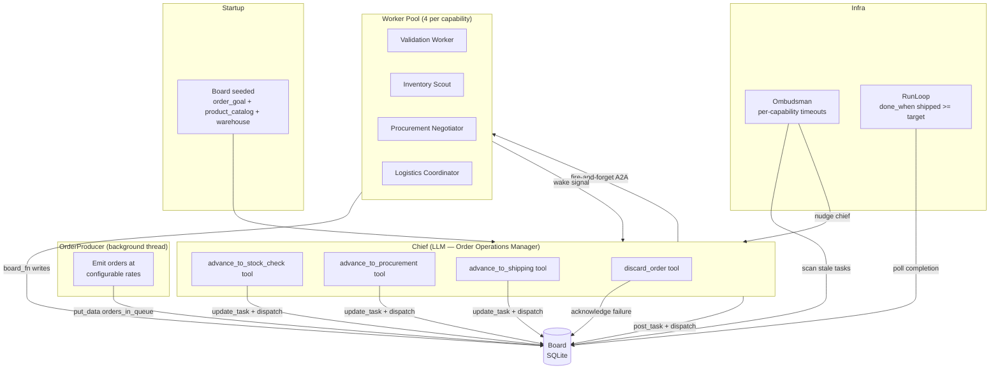
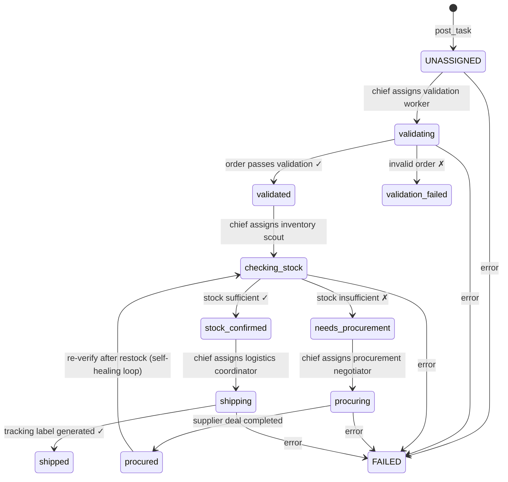
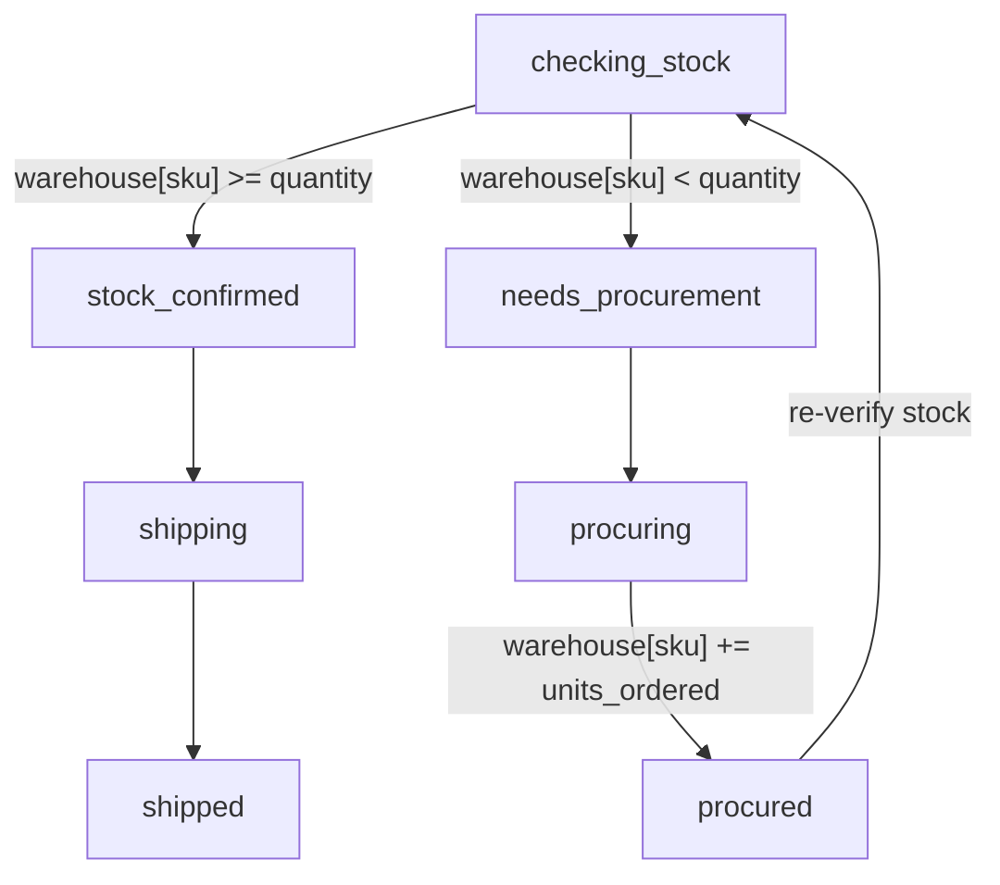
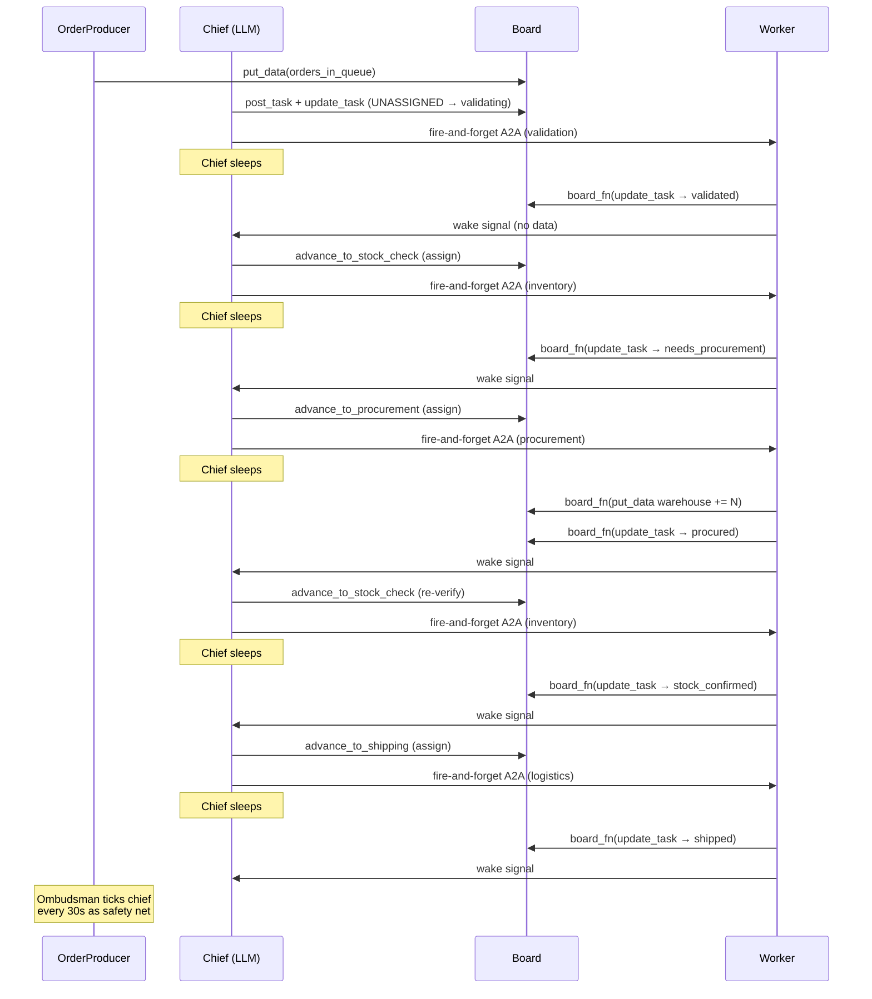

# LLM Ordering System — Self-Healing E-Commerce Pipeline

Multi-agent electronics e-commerce fulfillment system that processes customer
orders through a four-stage pipeline: **validation**, **inventory check**,
**procurement** (when stock is low), and **logistics**. An LLM chief
coordinates the pipeline using board tools while an `OrderProducer` feeds
orders onto the board at configurable rates.

This example demonstrates Quadro's coordination patterns with an **LLM-driven
chief**, a **custom multi-stage lifecycle profile**, **conditional branching**
(sufficient stock vs. procurement), a **self-healing restock loop**, **reactive
wakeup**, and a configurable **order emission system** with profiles and
choreographies for observing different Chief sleep patterns.

---

## The use case

> An electronics e-commerce warehouse processes incoming customer orders. Each
> order must be validated against the product catalog, checked against warehouse
> inventory, and shipped with a tracking number. When stock is insufficient, the
> system autonomously contacts suppliers, negotiates the best deal, restocks the
> warehouse, and re-verifies before shipping.
>
> No single agent can handle the full pipeline. The work is inherently
> multi-stage, multi-agent, and governed: every order must pass through every
> stage, every transition is validated, and the full audit trail is preserved.

This ordering system models a **real supply chain pipeline** as a Quadro
coordination problem. The operations manager is an LLM chief with board tools.
The four departments are LLM worker pools. The board enforces the lifecycle —
orders cannot skip stages, insufficient stock triggers a procurement loop, and
the ombudsman catches workers that go silent.

The `OrderProducer` runs in a background thread and emits orders at
configurable rates — from rapid bursts to long droughts — using emission
profiles. Choreographies cycle through profiles automatically, producing
distinct Chief sleep patterns visible in the Board UI. The chief never creates
orders; it only routes what the producer has posted.

**What makes this interesting as a Quadro example:**

- The chief is an **LLM with tools**, not a hardcoded router — it reads the
  board and decides what to do, but the board constrains what it *can* do.
- The **self-healing restock loop** (`needs_procurement → procuring → procured
  → checking_stock`) means orders autonomously trigger procurement and
  re-verify before shipping — no human intervention needed.
- **Conditional branching** at the inventory check stage: sufficient stock goes
  directly to shipping, insufficient stock detours through procurement.
- **Board data as inventory**: warehouse stock levels are stored on the board
  and updated by both the inventory scout (decrement) and procurement
  negotiator (increment), making the board the single source of truth for both
  task state and business data.
- **Reactive wakeup** means the chief is not called on a timer — workers signal
  it after every board write, and the ombudsman provides a safety net.
- **Emission profiles** let you observe how the system behaves under different
  load conditions — from constant pressure to near-silence.

---

## Architecture

### System overview



### Order lifecycle profile

Each order task follows an eleven-stage custom lifecycle. The inventory check
stage branches: sufficient stock proceeds to shipping, insufficient stock
detours through procurement. After procurement, the order loops back to
`checking_stock` for re-verification — the **self-healing restock loop**.



### Conditional branching detail

The inventory check is the decision point. This is what makes the ordering
system richer than a linear pipeline — the same task can take two different
paths depending on warehouse state.



### Reactive wakeup sequence

The chief is **not** polled every cycle. Workers signal the chief after every
board write, and the chief dispatches all actionable tasks in a single pass.



### Agent roles

| Agent | Type | Role |
|-------|------|------|
| **Chief** | LLM (operations manager) | Reads board, picks up queued orders, advances pipeline stages, dispatches workers |
| **OrderProducer** | Background thread | Emits orders onto the board at configurable rates using emission profiles |
| **Validation** workers | LLM | Validate order details against product catalog (JSON `OrderValidation`) |
| **Inventory** workers | LLM | Check warehouse stock levels, branch to fulfillment or procurement |
| **Procurement** workers | LLM | Evaluate 5 supplier offers, negotiate best deal, update warehouse stock |
| **Logistics** workers | LLM | Select carrier from 5 options, generate tracking number, calculate delivery date |
| **Ombudsman** | Timer | Detects stale workers (per-capability heartbeat timeouts) |

### Chief tools

The chief LLM has four board-aware tools. All worker dispatches are
fire-and-forget (daemon threads) to avoid blocking the chief's decision cycle.

| Tool | Description |
|------|-------------|
| `advance_to_stock_check` | Moves all `validated` or `procured` tasks to inventory check |
| `advance_to_procurement` | Moves all `needs_procurement` tasks to the procurement negotiator |
| `advance_to_shipping` | Moves all `stock_confirmed` tasks to logistics |
| `discard_order` | Acknowledges a `FAILED` or `validation_failed` order |

The chief policy also includes a **mechanical first pass** that:
1. Picks up orders from `orders_in_queue` (posted by the `OrderProducer`),
   creates them as board tasks, and dispatches to validation.
2. Dispatches any remaining `UNASSIGNED` tasks to validation workers.

Only the remaining pipeline stages (stock check, procurement, shipping) go
through the LLM.

### Data model

The board holds both task state and business data:

| Board data key | Contents |
|----------------|----------|
| `order_goal` | Target shipped count and domain description |
| `product_catalog` | 25 electronics products with SKU, name, brand, price, category |
| `warehouse` | Current stock levels per SKU (updated by inventory scout and procurement negotiator) |
| `orders_in_queue` | Customer orders posted by the `OrderProducer` (consumed by the chief) |

---

## File structure

```
ordering_system/
├── main.py              Entry point — board, pool, chief, producer, ombudsman, run loop
├── agents.py            Worker execute_fns + chief policy builder
├── tools.py             Chief board tools (advance_to_*, discard_order)
├── schemas.py           Pydantic models (OrderValidation, InventoryCheck, etc.)
├── data.py              Product catalog (25 SKUs), suppliers (5), carriers (5),
│                        warehouse stock, customer details
├── producer.py          OrderProducer — configurable order emission with profiles
├── reset.sh             Dev script — deletes DB
├── docker/              Docker setup — see Running with Docker below
└── prompts/
    ├── chief.md         Order Operations Manager system prompt
    ├── validation.md    Order validation against catalog
    ├── inventory.md     Warehouse stock check
    ├── procurement.md   Supplier negotiation
    └── logistics.md     Carrier selection and shipping
```

---

## Prerequisites

1. **Quadro** installed (or run from the repo root so `src/` is on the path):

   ```bash
   pip install -e .
   ```

2. **Microsoft Agent Framework** and **Pydantic** installed:

   ```bash
   pip install agent-framework pydantic python-dotenv
   ```

3. **LLM server** running an OpenAI-compatible API. Configure via environment
   variables or a `.env` file (see [Configuration](#configuration)):

   ```bash
   export OPENAI_API_KEY=your-key
   export OPENAI_BASE_URL=https://api.openai.com/v1
   export OPENAI_MODEL_ID=gpt-4.1
   ```

   Or use a local model server (Ollama, sglang, vLLM, etc.) at any
   OpenAI-compatible endpoint.

---

## Running locally

From the repo root:

```bash
# Default: 10 orders, steady profile, up to 1000 chief cycles
python examples/microsoft_agent_framework/ordering_system/main.py

# Quick 3-order run
python examples/microsoft_agent_framework/ordering_system/main.py --target 3

# Larger run with more cycles
python examples/microsoft_agent_framework/ordering_system/main.py --target 20 --cycles 2000

# Different emission profile
python examples/microsoft_agent_framework/ordering_system/main.py --profile burst

# Named choreography (cycles through profiles automatically)
python examples/microsoft_agent_framework/ordering_system/main.py --choreography wave_study
```

### Board UI

In a second terminal while the system is running:

```bash
python -m quadro.ui examples/microsoft_agent_framework/ordering_system/orders.db
```

Open <http://localhost:8080> to see the live Kanban view with all pipeline
stages as columns — including the procurement loop.

### Starting fresh

Delete `orders.db` to reset:

```bash
rm -f examples/microsoft_agent_framework/ordering_system/orders.db
```

---

## Running with Docker

The `docker/` folder contains a self-contained setup that runs the ordering
system and the Board UI together in a single container. It supports two LLM
providers: **Ollama** (local, default) and **OpenAI** (or any
OpenAI-compatible API).

**What it does:**
- Starts the ordering system pipeline as the foreground process
- Starts the Board UI as a background process inside the same container
- Exposes the Board UI on port 8081
- Creates a fresh `orders.db` on every container start
- Bind-mounts `src/quadro` and the example source for live code reloading
- When `LLM_PROVIDER=ollama`: waits for Ollama health and pulls the model
- When `LLM_PROVIDER=openai`: validates `OPENAI_API_KEY` and skips Ollama setup

### Quick start

```bash
cd examples/microsoft_agent_framework/ordering_system/docker

# Copy and edit configuration (set your LLM provider and API key)
cp .env.example .env

# Start (default: 10 orders, steady profile)
./up.sh

# Start with custom options
./up.sh --target 5
./up.sh --profile burst
./up.sh --choreography wave_study
./up.sh --target 20 --cycles 2000
```

**Windows (PowerShell):**

```powershell
cd examples\microsoft_agent_framework\ordering_system\docker
.\up.ps1
.\up.ps1 -Target 5
.\up.ps1 -Profile burst
.\up.ps1 -Choreography wave_study
```

### Board UI

While the ordering system is running, open <http://localhost:8081> in any
browser. The Kanban view updates live as orders move through the pipeline.

### Stopping

```bash
./down.sh            # stop containers
./down.sh --clean    # stop and remove all volumes (full reset)
```

**Windows:**

```powershell
.\down.ps1           # stop containers
.\down.ps1 -Clean    # stop and remove all volumes (full reset)
```

### Debug mode

A debug compose file launches the ordering system under
[debugpy](https://github.com/microsoft/debugpy), waiting for VS Code / Cursor
to attach on port 5679.

**Step 1 — Start the debug container:**

```bash
cd examples/microsoft_agent_framework/ordering_system/docker
docker compose -f docker-compose.debug.yml up --build
```

Wait for the log line:

```
[debug-entrypoint] debugpy listening on 0.0.0.0:5679 — WAITING for debugger to attach ...
```

**Step 2 — Attach the debugger:**

The repo includes a `.vscode/launch.json` with pre-configured debug profiles.
Open the **Run and Debug** panel (Ctrl+Shift+D), select **"Attach: Ordering
Docker"**, and press F5.

There is also a **"Launch: Ordering Local"** config for debugging without
Docker — it runs `main.py` directly on the host with `--target 1`.

Source code is bind-mounted into the container, so breakpoints in
`src/quadro/`, `examples/microsoft_agent_framework/ordering_system/`, and
`examples/microsoft_agent_framework/shared.py` all work without rebuilding.
The Board UI is available at <http://localhost:8081> while debugging.

Set `DEBUGPY_WAIT=0` in your `.env` to skip waiting for the debugger (debugpy
still listens, so you can attach later).

### Configuration

All parameters are set via environment variables. Copy `.env.example` to `.env`
and edit as needed:

| Variable | Default | Description |
|---|---|---|
| `LLM_PROVIDER` | `ollama` | `"ollama"` or `"openai"` — controls entrypoint behaviour |
| `ORDERING_TARGET` | `10` | Number of orders to ship |
| `ORDERING_CYCLES` | `1000` | Maximum chief decision cycles |
| `ORDERING_PROFILE` | `steady` | Emission profile (see [Emission profiles](#emission-profiles)) |
| `ORDERING_CHOREOGRAPHY` | _(empty)_ | Named choreography (overrides profile) |
| `OLLAMA_MODEL` | `gpt-oss:20b` | Model for Ollama to pull and serve |
| `OLLAMA_BASE_URL` | `http://localhost:11434` | Ollama API endpoint |
| `OPENAI_API_KEY` | `ollama` | API key (required when `LLM_PROVIDER=openai`) |
| `OPENAI_BASE_URL` | `http://localhost:11434/v1` | OpenAI-compatible base URL |
| `OPENAI_MODEL_ID` | `gpt-oss:20b` | Model identifier passed to the client |
| `UI_PORT` | `8081` | Host port for the Board UI |

Variables can also be passed inline without editing `.env`:

```bash
ORDERING_TARGET=20 ORDERING_PROFILE=burst ./up.sh
```

**Example: using OpenAI directly**

```env
LLM_PROVIDER=openai
OPENAI_API_KEY=sk-your-key-here
OPENAI_BASE_URL=https://api.openai.com/v1
OPENAI_MODEL_ID=gpt-4.1
```

**Example: using a local Ollama instance**

```env
LLM_PROVIDER=ollama
OLLAMA_MODEL=gpt-oss:20b
OPENAI_API_KEY=ollama
OPENAI_BASE_URL=http://localhost:11434/v1
OPENAI_MODEL_ID=gpt-oss:20b
```

### Docker file structure

```
docker/
├── Dockerfile               Single-container image (ordering system + Board UI)
├── docker-compose.yml       Ordering service with network_mode: host
├── docker-compose.debug.yml Debug variant — debugpy on port 5679
├── entrypoint.sh            Startup: wait for LLM → clean DB → start UI → run pipeline
├── entrypoint.debug.sh      Debug startup: same + debugpy --wait-for-client
├── requirements.txt         Python dependencies installed in the image
├── .env.example             Configuration template
├── up.sh                    Start script (bash)
├── down.sh                  Stop script (bash)
├── up.ps1                   Start script (PowerShell)
└── down.ps1                 Stop script (PowerShell)
```

---

## CLI flags

| Flag | Default | Description |
|------|---------|-------------|
| `--target` | `10` | Number of orders to ship before stopping |
| `--cycles` | `1000` | Maximum chief decision cycles |
| `--profile` | `steady` | Emission profile (mutually exclusive with `--choreography`) |
| `--choreography` | _(none)_ | Named choreography (mutually exclusive with `--profile`) |

### Emission profiles

The `OrderProducer` supports six emission profiles that control how orders are
posted onto the board. Each profile produces a different Chief sleep pattern
visible in the Board UI.

| Profile | Behaviour |
|---------|-----------|
| `burst` | Rapid batches (3-8 orders), short pauses — Chief wakes frequently |
| `steady` | Regular small batches (1-3 orders), even cadence — predictable sleep pattern |
| `slow` | Occasional single orders, long pauses — Chief sleeps most of the time |
| `wave` | Bursts and silence alternating — visible wave in sleep sparkline |
| `drought` | Very long pauses, rare orders — tests stale task detection |
| `idle` | No orders at all — Chief stays asleep; baseline sleep study |

Switch profile at runtime (single-profile mode only):

```python
producer.set_profile("drought")
```

### Named choreographies

Choreographies cycle through `(profile, duration_seconds)` steps automatically,
producing visually distinct sleep patterns without manual intervention:

| Name | Steps | Description |
|------|-------|-------------|
| `sleep_study` | `steady(30s) → idle(220s) → steady(60s) → idle(120s) → steady(60s) → idle(120s)` | Clear before/after sleep pattern changes |
| `wave_study` | `burst(30s) → idle(90s) → slow(60s) → idle(90s) → burst(30s) → idle(90s)` | Three distinct Chief rhythms back-to-back |
| `endurance` | `steady(120s) → drought(180s) → burst(60s) → idle(60s)` | Full run: stale detection + recovery |

---

## Output

| Artifact | Description |
|----------|-------------|
| **Console** | Per-cycle progress (shipped / active / failed), producer stats (profile, orders emitted, choreography step), final summary with task states and warehouse delta |
| **`orders.db`** | SQLite board state with full event audit trail |
| **Exit code** | `0` if target reached, `1` otherwise |

---

## Quadro patterns used

| Pattern | How it appears |
|---------|----------------|
| **The Board** | Single source of truth — tasks, statuses, assignments, outputs, warehouse inventory, product catalog |
| **Hydration** | Chief and workers receive context from the board at invocation time |
| **Stateless invocation** | Workers are async coroutines; all state lives on the board |
| **The Chief** | LLM policy with board tools; one decision cycle per wake |
| **Lifecycle profile** | Custom 11-stage `"order"` profile with conditional branching and self-healing restock loop |
| **Frozen taxonomy** | All events flow through A2A contracts and frozen event types |
| **The Ombudsman** | Per-capability heartbeat timeouts (validation 2 min, inventory 30s, procurement 10 min, logistics 5 min) |
| **Reactive wakeup** | Workers signal chief after completion; pending-wake serialization |
| **A2A-only boundaries** | All cross-component calls go through `network.request()` |
