# LLM token-budget demo

This example answers the question reviewers always ask: **"how do I stop
this from burning my LLM budget?"**

> **See [`output_sample/REPORT.md`](output_sample/REPORT.md)** for what a real
> run produces — two runs of this code against OpenAI `gpt-5.4` with budgets
> of `50,000` and `500`, showing both termination paths, every classifier
> output, and the exact tokens burned. One click, no setup.

A queue of 15 support tickets is triaged by a single LangChain-backed
classifier stage. The whole run is governed by an `AllOf` composition of
three sponsors:

| Sponsor | Role | What it watches |
|---|---|---|
| `QueueDepthSponsor("tickets_queue")` | Primary | Board data key kept in sync with pending tasks |
| `LlmTokenBudgetSponsor(LLM_BUDGET)` | The star | Cumulative `prompt + completion` tokens from every LangChain call |
| `DeadlineSponsor.from_now(minutes=3)` | Safety rail | Wall-clock cut-off |

`AllOf` folds the three decisions with an axis-wise minimum lease —
the runtime re-consults as soon as the tightest ceiling is hit, and
any `Stop` from any child halts the whole composite. See
[docs/guides/sponsor-decision-matrix.md](../../../docs/guides/sponsor-decision-matrix.md)
for the full rules.

## Run it twice

Copy `.env.example` to `.env` and set `OPENAI_API_KEY` /
`OPENAI_MODEL_ID` / `OPENAI_BASE_URL` for whichever OpenAI-compatible
endpoint you want — OpenAI proper, local Ollama, local
vLLM/SGLang/LiteLLM, or anything else that speaks `/v1/chat/completions`.

By default, this example uses the **native LangChain runtime path**
(`stage(supervisor=...)`) through the `quadro_langchain` adapter, which
exercises the same control-plane runtime delegation model as the MAF examples.

```bash
cp .env.example .env
python main.py                                     # default LLM_BUDGET=5000, native mode

LLM_BUDGET=50000 python main.py                    # queue empties first  -> Drain
LLM_BUDGET=500   python main.py                    # budget trips first   -> Stop

# Compatibility/reference mode (previous prompt/schema adapter path):
python main.py --stage-mode compat
# or: LC_STAGE_MODE=compat python main.py
```

Two runs, one binary, two termination paths.

Add `--output-dir output/generous` (or `.../tight`) to either invocation and
you'll also get a committable `run.json` artefact — see
[Output artefacts](#output-artefacts).

### Run 1 — `LLM_BUDGET=50000` (queue empties, graceful drain)

```text
LLM token-budget demo — tickets=15  budget=50000  model=gpt-5.4
[cycle   0] tickets= 3/15 (failed=0 active=3 pending=12)  tokens=[#.......................]  3036/50000  lease=all_of
[cycle   5] tickets= 7/15 (failed=0 active=2 pending= 8)  tokens=[##......................]  4992/50000  lease=all_of
[cycle   9] tickets= 9/15 (failed=0 active=3 pending= 6)  tokens=[###.....................]  7012/50000  lease=all_of
[cycle  13] tickets=11/15 (failed=0 active=1 pending= 4)  tokens=[####....................]  9061/50000  lease=all_of
[cycle  17] tickets=14/15 (failed=0 active=1 pending= 1)  tokens=[#####...................] 10989/50000  lease=all_of
[cycle  20] tickets=15/15 (failed=0 active=0 pending= 0)  tokens=[######..................] 12765/50000  lease=all_of  (DRAINING)
RunLoop: drain complete (no active tasks)

========================================================================
  LLM token-budget demo complete
========================================================================
  Classified: 15/15   (failed=0)
  Tokens used: 12765 / 50000
  Wall time:   16.2s
  Sponsor decisions (last 8):
    continue  'all_of:queue_depth:6>=1 & llm_tokens_budget:9061/50000 & deadline:...'   @  9061 tok
    continue  'all_of:queue_depth:4>=1 & llm_tokens_budget:9061/50000 & deadline:...'   @  9061 tok
    continue  'all_of:queue_depth:4>=1 & llm_tokens_budget:9555/50000 & deadline:...'   @  9555 tok
    continue  'all_of:queue_depth:3>=1 & llm_tokens_budget:10484/50000 & deadline:...' @ 10484 tok
    continue  'all_of:queue_depth:3>=1 & llm_tokens_budget:10989/50000 & deadline:...' @ 10989 tok
    continue  'all_of:queue_depth:2>=1 & llm_tokens_budget:11514/50000 & deadline:...' @ 11514 tok
    continue  'all_of:queue_depth:1>=1 & llm_tokens_budget:12426/50000 & deadline:...' @ 12426 tok
    drain     'all_of:queue_empty:tickets_queue'                  @ 12765 tok
========================================================================
```

*(6 of the 21 cycle ticks shown for brevity — see
[`output_sample/REPORT.md`](output_sample/REPORT.md) for the full
decision chain.)*

All 15 tickets classified in roughly a quarter of the budget. The queue
drained first, so the sponsor returned `Drain`; `RunLoop` let the last
in-flight classifiers finish, then auto-stopped.

### Run 2 — `LLM_BUDGET=500` (budget trips first, hard stop)

```text
LLM token-budget demo — tickets=15  budget=500  model=gpt-5.4

========================================================================
  LLM token-budget demo complete
========================================================================
  Classified: 15/15   (failed=0)
  Tokens used: 13407 / 500
  Wall time:   12.7s
  Sponsor decisions (last 1):
    stop      'all_of:llm_tokens_budget_exhausted:13407/500'      @ 13407 tok
========================================================================
```

OpenAI responds fast enough that three parallel workers classify the
whole 15-ticket queue (~13 400 tokens) inside a single poll interval —
so the sponsor gets exactly one chance to consult, sees the meter is
already way past `500`, and returns `Stop`. The run exits with code `2`
and the budget is enforced: the next consultation would never
authorise more work.

The overshoot (`13407 >> 500`) is the cost of concurrency combined
with a fast hosted LLM: three workers had already committed their
turns before the sponsor woke up. Two easy knobs let you tighten this
into the "partial drain" shape the MAF sibling example shows against a
slower local endpoint:

- Drop `.workers(3)` to `.workers(1)` in `main.py` to serialise the
  classifier, or
- Lower `POLL_INTERVAL` from `1.0` to `0.1` so the sponsor consults ten
  times per second instead of once.

Either change trades throughput for tighter budget enforcement. The
point stays the same: **the run halts on cost, predictably, and reports
why** (exit code `2`, `stop` in the sponsor log, `budget_exhausted` in
the reason).

Exit codes: the script returns `2` when the budget stops the run and
`0` when the queue drains naturally, so CI or operators can tell the
two apart.

## How the budget is enforced

```mermaid
flowchart LR
    Worker["classify stage turn<br/>(native supervisor or compat execute_fn)"] -->|ChatOpenAI.ainvoke| LLM["OpenAI-compat /v1"]
    LLM -->|AIMessage with usage_metadata| LC["LangChain AIMessage"]
    LC -->|prompt + completion| Reporter["token_reporter =<br/>runtime.meters.report_llm_tokens"]
    Reporter --> Bundle["runtime.meters<br/>(MeterBundle)"]
    Bundle -->|snapshot on consult| Sponsor["LlmTokenBudgetSponsor"]
    Sponsor -->|"Continue | Stop"| Loop["RunLoop"]
```



Three pieces cooperate:

1. `QuadroRuntime.meters` is a shared `MeterBundle`. Every runtime has
   one, lazily constructed on first read.
2. `LangChainReasoner(..., token_reporter=runtime.meters.report_llm_tokens)`
   and `LangChainChiefRuntime(..., token_reporter=...)` tell the LangChain
   integration to extract token usage from every call and push
   `prompt_tokens + completion_tokens` into that bundle.
3. `LlmTokenBudgetSponsor(N)` reads `ctx.meters.llm_tokens` on each
   consultation. When it exceeds `N`, it returns `Stop`.

That's it — a three-line wiring chain that makes the sponsor load-bearing.

## Wiring your own provider

Anything that speaks OpenAI-compat works. Change only the three env
vars; the code is untouched.

- **OpenAI proper** — `OPENAI_BASE_URL=https://api.openai.com/v1`,
  a real `OPENAI_API_KEY`, and whichever model you prefer.
- **Local Ollama** — `OPENAI_BASE_URL=http://localhost:11434/v1`,
  `OPENAI_API_KEY=ollama`, `OPENAI_MODEL_ID=llama3.2` (or any pulled
  model).
- **vLLM / SGLang / LiteLLM** — same shape; use whatever URL your
  deployment exposes, plus the model id it serves.

Token usage extraction is defensive: the LangChain adapter probes
`AIMessage.usage_metadata` and `response_metadata['token_usage']` /
`['usage']` in turn, accepts both
`prompt_tokens`/`completion_tokens` and `input_tokens`/`output_tokens`
naming, and silently reports `0` when the provider doesn't surface
usage at all. Telemetry never fails a worker.

## Output artefacts

Pass `--output-dir <path>` and the script serialises a `run.json` at
the end of the run — `meta` (budget / model / endpoint / wall time /
final decision), `summary` (classified / tokens / utilisation), the
full `sponsor_log` decision chain, and every ticket with its parsed
`TicketTag`.

Render two `run.json`s into a single `REPORT.md` with the companion
script (pure stdlib, no LangChain dependency):

```bash
LLM_BUDGET=50000 python main.py --output-dir output/generous
LLM_BUDGET=500   python main.py --output-dir output/tight

python render_report.py \
    --generous output/generous/run.json \
    --tight    output/tight/run.json \
    --out      output/REPORT.md
```

The committed [`output_sample/`](output_sample/) is exactly the result
of running that recipe against OpenAI `gpt-5.4`, for anyone who wants
to see what the example produces without setting up the keys.

## Why this is a good sponsor-story

- **Load-bearing budget**: the `LlmTokenBudgetSponsor` genuinely
  terminates the run when the ceiling is hit — not a decoration.
- **Graceful wind-down vs. hard stop**: swapping the env var reveals
  both shapes (`Drain` when the queue empties, `Stop` when the budget
  trips). That maps straight onto the production cookbook in the
  [Sponsor decision matrix](../../../docs/guides/sponsor-decision-matrix.md#production-defaults-cookbook).
- **Telemetry you can see**: the live progress bar reads from the
  already-published `_sponsor_status` key on the board; no custom
  instrumentation needed.
- **Portable**: one `.env` change points the same code at OpenAI,
  Ollama, or any OpenAI-compat endpoint.

## A note on the saga DSL

**A note on the saga DSL.** This example deliberately stays on the
workflow path even though Quadro's saga DSL would also work for the
classification stage. The teaching purpose here is the **sponsor
system** — budget enforcement, soft warnings, hard caps, and the
meter telemetry that drives the decision matrix. Converting the
classifier to a saga would dilute that focus by mixing two concerns.
The workflow form is preserved so the budget story stays the
centre of attention.
