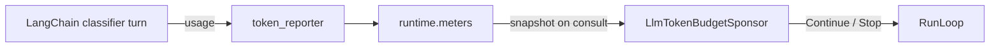

# Token-Budget Run Report

*Real runs of `examples/token_budget/main.py` against `gpt-5.4` at `https://api.openai.com/v1`.*

## Two runs, one binary, two termination paths

| Run      | Budget  | Classified | Tokens used       | Decision | Wall time | Reason |
|----------|--------:|-----------:|------------------:|:---------|----------:|:-------|
| Generous |  50,000 | 15 / 15 |  12,765 ( 25.5%) | Drain    |  16.2 s | all_of:queue_empty:tickets_queue |
| Tight    |     500 | 15 / 15 |  13,407 (2681.4%) | Stop     |  12.7 s | all_of:llm_tokens_budget_exhausted:13407/500 |

The **generous** run classified all 15 tickets spending only **25.5%** of the budget; the **tight** run was stopped by the sponsor at **13,407 tokens** (2681.4% of its `500` budget — the overshoot is the cost of concurrency: workers already in flight when the sponsor sampled below the ceiling). Both outcomes come from the same `AllOf(QueueDepthSponsor, LlmTokenBudgetSponsor, DeadlineSponsor)` composition; only `LLM_BUDGET` differs.

## Run 1 — Generous

- **Budget:** `50,000` tokens
- **Final decision:** `drain`
- **Wall time:** 16.2 s
- **Classified:** 15 / 15 (0 failed)
- **Generated:** 2026-04-26T19:28:20+00:00

### Token usage

```
[#########...........................]  12,765 / 50,000  (25.5%)
```

### Sponsor decision chain

| Cycle | Decision | Tokens at | Reason |
|------:|:---------|----------:|:-------|
|     0 | continue |     3,036 | queue_depth:15>=1 & llm_tokens_budget:3036/50000 |
|     1 | continue |     3,036 | queue_depth:15>=1 & llm_tokens_budget:3036/50000 |
|     2 | continue |     3,539 | queue_depth:12>=1 & llm_tokens_budget:3539/50000 |
|     3 | continue |     4,034 | queue_depth:11>=1 & llm_tokens_budget:4034/50000 |
|     4 | continue |     4,535 | queue_depth:10>=1 & llm_tokens_budget:4535/50000 |
|     5 | continue |     4,992 | queue_depth:9>=1 & llm_tokens_budget:4992/50000 |
|     6 | continue |     5,513 | queue_depth:9>=1 & llm_tokens_budget:5513/50000 |
|     7 | continue |     5,513 | queue_depth:8>=1 & llm_tokens_budget:5513/50000 |
|     8 | continue |     6,501 | queue_depth:8>=1 & llm_tokens_budget:6501/50000 |
|     9 | continue |     7,012 | queue_depth:7>=1 & llm_tokens_budget:7012/50000 |
|    10 | continue |     7,012 | queue_depth:6>=1 & llm_tokens_budget:7012/50000 |
|    11 | continue |     7,012 | queue_depth:6>=1 & llm_tokens_budget:7012/50000 |
|    12 | continue |     7,012 | queue_depth:6>=1 & llm_tokens_budget:7012/50000 |
|    13 | continue |     9,061 | queue_depth:6>=1 & llm_tokens_budget:9061/50000 |
|    14 | continue |     9,061 | queue_depth:4>=1 & llm_tokens_budget:9061/50000 |
|    15 | continue |     9,555 | queue_depth:4>=1 & llm_tokens_budget:9555/50000 |
|    16 | continue |    10,484 | queue_depth:3>=1 & llm_tokens_budget:10484/50000 |
|    17 | continue |    10,989 | queue_depth:3>=1 & llm_tokens_budget:10989/50000 |
|    18 | continue |    11,514 | queue_depth:2>=1 & llm_tokens_budget:11514/50000 |
|    19 | continue |    12,426 | queue_depth:1>=1 & llm_tokens_budget:12426/50000 |
|    20 | drain    |    12,765 | queue_empty:tickets_queue |

### Classifier outputs

| Ticket | Urgency  | Category         | Suggested reply (truncated) |
|:-------|:---------|:-----------------|:----------------------------|
| T-001  | high     | account          | Sorry you're running into this — I can see this is blocking your te… |
| T-002  | medium   | billing          | Thanks for flagging this. I can help review the $49 'platform uplif… |
| T-003  | low      | feature_request  | Thanks for the suggestion — I can see how exporting a full quarter… |
| T-004  | critical | outage           | Thanks for flagging this — we understand your checkout flow is retu… |
| T-005  | low      | other            | Thanks so much for the kind words—we’re glad the new dashboard is l… |
| T-006  | low      | feature_request  | Thanks for reaching out about your Okta migration. I can help clari… |
| T-007  | medium   | billing          | Thanks for flagging this — I’m sorry about the duplicate charge. We… |
| T-008  | medium   | other            | Thanks for flagging this — I’m sorry for the trouble with the 429s… |
| T-009  | high     | account          | Sorry you’re having trouble accessing your account. I can help revi… |
| T-010  | high     | other            | Thanks for flagging this again — I’m sorry the org export is failin… |
| T-011  | low      | feature_request  | Thanks for the feedback — I can see how dark mode would make things… |
| T-012  | medium   | billing          | Thanks for the update — we can help with changing the billing addre… |
| T-013  | critical | account          | Thanks for flagging this. We’re reviewing the sign-in activity and… |
| T-014  | low      | billing          | Thanks for reaching out about expanding your rollout. We can share… |
| T-015  | low      | feature_request  | Thanks for the detailed feedback on webhook retry behavior. I can s… |

## Run 2 — Tight

- **Budget:** `500` tokens
- **Final decision:** `stop`
- **Wall time:** 12.7 s
- **Classified:** 15 / 15 (0 failed)
- **Generated:** 2026-04-26T19:28:40+00:00

### Token usage

```
[####################################]  13,407 / 500  (2681.4%)
```

### Sponsor decision chain

| Cycle | Decision | Tokens at | Reason |
|------:|:---------|----------:|:-------|
|     0 | stop     |    13,407 | llm_tokens_budget_exhausted:13407/500 |

### Classifier outputs

| Ticket | Urgency  | Category         | Suggested reply (truncated) |
|:-------|:---------|:-----------------|:----------------------------|
| T-001  | high     | account          | Sorry you’re running into this. Since password resets haven’t resol… |
| T-002  | medium   | billing          | Thanks for flagging this — I can help review the $49 'platform upli… |
| T-003  | low      | feature_request  | Thanks for the feedback — I can see how exporting a full quarter in… |
| T-004  | critical | outage           | Thanks for flagging this — we understand your checkout flow is retu… |
| T-005  | low      | other            | Thanks so much for the kind words—we’re glad to hear the new dashbo… |
| T-006  | low      | feature_request  | Thanks for reaching out about your Okta migration. I can help clari… |
| T-007  | medium   | billing          | Thanks for flagging this — I’m sorry for the duplicate charge. We’l… |
| T-008  | medium   | other            | Thanks for flagging this — I can see how unexpected 429s on /v1/exp… |
| T-009  | high     | account          | Sorry you’re unable to access your account. We can help review the… |
| T-010  | high     | other            | Thanks for flagging this again, and I’m sorry you’re running into r… |
| T-011  | low      | feature_request  | Thanks for the feedback—we understand dark mode would make the prod… |
| T-012  | medium   | billing          | Thanks for reaching out — we can help update the billing address on… |
| T-013  | critical | account          | Thanks for flagging this — we’re reviewing the sign-in activity and… |
| T-014  | low      | billing          | Thanks for reaching out — we’d be happy to help with enterprise pri… |
| T-015  | low      | feature_request  | Thanks for the detailed feedback on webhook retry behavior. I can s… |

## How tokens reach the sponsor



Every LangChain call (chief and classifier) surfaces token
accounting on the returned `AIMessage` — the adapter probes
`usage_metadata`, `response_metadata["token_usage"]`, and
`response_metadata["usage"]` in turn, sums
`prompt_tokens + completion_tokens`, and calls the
`token_reporter` you wired via
`LangChainReasoner(..., token_reporter=runtime.meters.report_llm_tokens)`.
`LlmTokenBudgetSponsor` reads `ctx.meters.llm_tokens` on each
consultation and halts the run when cumulative usage exceeds
the budget.

See [../README.md](../README.md) for the wiring details and
[../../../../docs/guides/sponsor-decision-matrix.md](../../../../docs/guides/sponsor-decision-matrix.md)
for the full sponsor cookbook.

## Reproduce

```bash
cp .env.example .env            # set OPENAI_API_KEY / _MODEL_ID / _BASE_URL

LLM_BUDGET=50000 python main.py --output-dir output/generous
LLM_BUDGET=500   python main.py --output-dir output/tight

python render_report.py \
    --generous output/generous/run.json \
    --tight    output/tight/run.json \
    --out      output/REPORT.md
```

